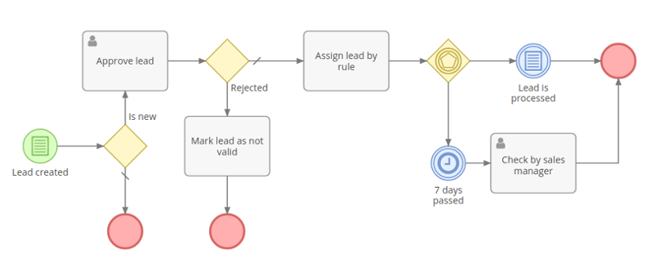
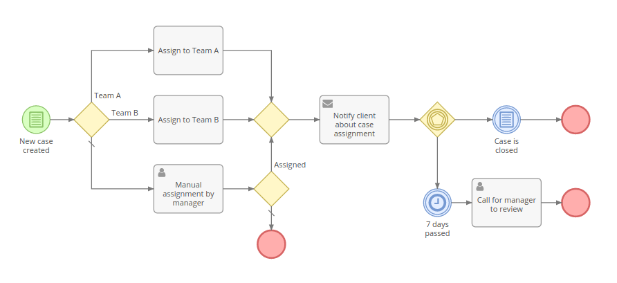
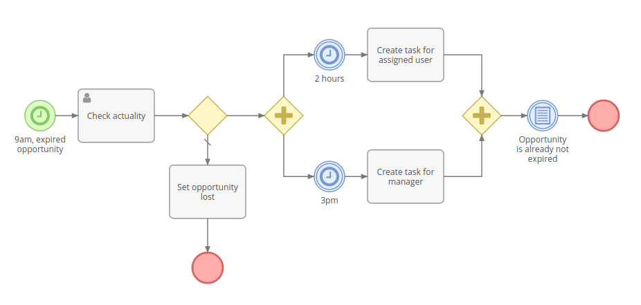

# Business Process Management

Business Process Management (BPM) tool provides the ability to model and automate business processes in EspoCRM. It's an engine executing business processes described in BPMN 2.0 standard. BPM tool is available in [Advanced Pack](https://www.espocrm.com/extensions/advanced-pack/) extension.

### Difference from Workflows tool

Workflows tool is intended for automation of simple business rules, w/o sequential flow items, when there is no need to display the flow graphically.

BPM tool is intended for more complex business flows, where there can be diverging and converging flows, execution delays, user interactions. A flowchart view makes the business process more comprehensible for a human, a log allows to see how the process was held.

## Process Flowcharts

The link to process flowcharts is available from administration panel. It also can be added as a tab on the navigation panel.

Flowcharts are intended for business processes modeling. Administrator can create and edit flowcharts. Regular users can only view flowcharts.

Every flowchart has its specific entity type (Target Type field). The flowchart determines execution of future process instances. It comprises flowchart elements and connections between elements.

If process flowchart has the unchecked 'Is Active' field then it won't initiate process instances.

To show details and parameters of a certain flowchart element you need to click on it. In edit mode you will be able to edit parameters.

## Processes

Processes are available from administration panel. The link also can be added as a tab on the navigation panel.

Process represents business process instance. When it's initiated it gets the status 'Started'. When process is finished it gets the status 'Ended'. The process can also be stopped manually by a user who has an access to edit the process. If it's stopped manually it gets status the 'Stopped'.

The process is executed according the flowchart. Flowchart of process can't be changed after process is started.

The process obligatorily is related to single target record.

Processes can be started automatically (upon specific conditions or by scheduling) or manually (where there is at least one Start Event in the flowchart). To start process manually the user needs to click 'Start Process' button on the list view of processes.

## Flowchart Elements

### Events

Events are displayed on a flowchart as circles.

#### Start Event

Doesn't have parameters. It's a starting point of the process. Start Event can be initiated manually by a user who has an access to create processes. The user needs to click  'Start Process' button on the list view of processes.

#### Conditional Start Event

A starting point of the process. It's supposed to be triggered automatically when specified conditions are met. There are two types of trigger: 'After record created', 'After record saved'.

#### Timer Start Event

A starting point of the process. It initiates processes by scheduling. You need to specify the list report that returns records for initiating processes and scheduling in crontab notation.

#### Conditional Intermediate Event

This event stops the flow until specified criteria is met.

#### Timer Intermediate Event

This event stops the flow and waits as long as is specified by event's parameters.

For more complex timer settings you can utilize [formula](formula.md). Formula scripts should return Date-Time value (in UTC timezone). Once this time comes the flow will be proceeded to the next element.

By utilizing datetime\closest formula function it's possible to set the timer to a specific time in the future, e.g. the beginning of the next working day.  

#### End Event

Ends the current flow. It doesn't end flows running in parallel. When the flow reaches the end event and there is no anything running in parallel then process ends.

#### Terminate End Event

Ends all flows. Process is subsequently ended.

### Gateways

Gateways are displayed as diamonds.

#### Exclusive Gateway

Can diverge or converge flows.

In case of diverging it defines a single flow (path) that will be chosen according specified criteria. The first met condition determines the flow, next conditions are omitted. There is an ability to specify default flow. Default flow is chosen if there are no any met conditions. Default flow is marked with a slash sign.

In case of converging it just directs the flow to the outgoing element. It doesn't get blocked after the flow come though, so parallel flows won't be merged into the single flow.

#### Inclusive Gateway

Can diverge or converge flows.

In case of diverging, it can direct to one or multiple parallel flows (paths), depending on accomplishment of criteria of each flow. Default flow is chosen if there are no any met conditions. Default flow is marked with a slash sign.

If there is a necessity to merge parallel flows produced by a diverging inclusive gateway you need to use a converging inclusive gateway. It will wait for all incoming flows and then continue to the outgoing element.

Note: Diverging and converging gateways must be balanced.

Note: If one of parallel flows has been ended for some reason then diverging gateway will never be processed. The process will be blocked. Avoid a flowchart design that can bring about such a situation.

#### Parallel Gateway

Can diverge or converge flows.

In case of diverging it splits flow into multiple parallel flows. There are no parameters for this gateway type.

In case of converging it waits until all incoming flows come and then continues to the next outgoing element.

Note: Diverging and converging gateways must be balanced.

Note: If one of parallel flows has been ended for some reason then diverging gateway will never be processed. The process will be blocked. Avoid a flowchart design that can bring about such a situation.

#### Event Based Gateway

Can only diverge flows.

It stops the flow until any of outgoing events gets triggered. Triggered event determines the single flow. Other outgoing events get rejected.

Only intermediate events can be on the other end of outgoing sequence flows.

### Activities

Activities are displayed as rounded rectangles.

#### Task

Task can execute following the actions:

* Create Record - creates new record of any entity type;
* Create Related Record - creates new record related to the target record;
* Update Target Record;
* Update Related Record - updates the record or records related to the target record;
* Update Created Record - updates specific field of any record created in the current process;
* Update Process Record - can be used to assign the process to specific user or team;
* Link to Another Record - links the target record with a specified record;
* Unlink from Another Record - unlinks the target record from the specified record;
* Apply Assignment Rule - assigns the target record, the process record or any record created by the process according to the specific rule;
* Create Notification - creates in-app notification for specific users;
* Make Followed - makes specific users follow the target record, the process record or any record created by the process;
* Run Service Action - runs custom service actions implemented by developers.

Actions available for task are almost the same as in Workflow feature. See more details about [workflow's actions](workflows.md#actions).

#### Send Message Task

Sends email message to specific recipient.

#### User Task

Provides a flexible ability of user interaction. It stops execution until the user (specified explicitly or by assignment rule) resolves the task. Process User Task record will be created in the system. By default there are three action types: Approve, Review, Accomplish.

* Approve type requires the user to chose between 'Approved' and 'Declined'.
* Review type gives only one option: 'Reviewed'.
* Accomplish type has two options: 'Completed' and 'Failed'.

The user assigned to the created Process User Task record will receive in-app notification. Administrator can also enable email notifications.

Users can also add Process User Tasks dashlet on their dashboard to see their actual process user tasks.

It's possible to read the resolution of the passed user task within diverging gateways or conditional events, making ramification in the process flow.

#### Script Task

Executes the script in [espo-formula](formula.md) language. All set variables (`$variableName`) will be stored and available within the process.

### Flows

#### Sequence Flow

Represented as a solid arrow. Indicates the order in which process elements will be executed.

## Conditions

Conditional events, exclusive and inclusive diverging gateways have conditions that determine the flow of the process.

Through UI there is an ability to check conditions for the following records:

* Target record;
* Records related to the target through many-to-one and children-to-parent relationships;
* Records created by the process via tasks;
* User task records, which allows checking the resolution.

It's also possible to define conditions in [Espo-formula](formula.md) language.

Conditions in BPM tool are the same as in Workflow feature. See more details about [workflow's conditions](workflows.md#conditions).

## Examples

### Example 1

### Example 2

### Example 3

