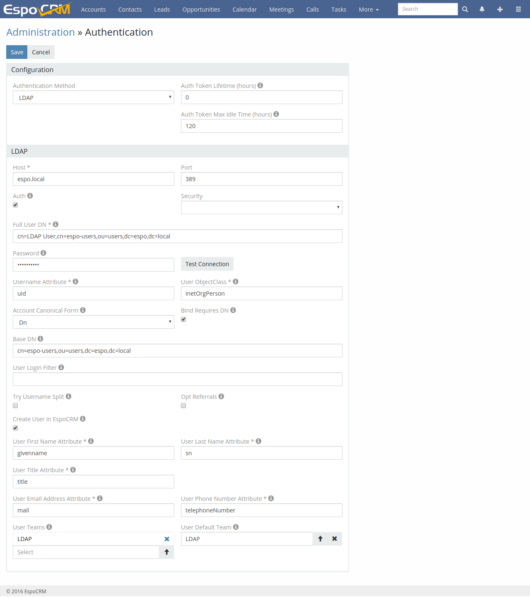

#LDAP authorization for Active Directory

Example of configuration LDAP authorization for the Active Directory server. The full guide of configuration LDAP authorization is described [here](https://github.com/espocrm/documentation/blob/master/administration/ldap-authorization.md).

```
Host: espo.local
Port: 389
Full User DN: cn=LDAP User,cn=espo-users,ou=users,dc=espo,dc=local
Password: ******
Username Attribute: uid
User ObjectClass: inetOrgPerson
Account Canonical Form: Dn
Bind Requires DN: yes
Base DN: cn=espo-users,ou=users,dc=espo,dc=local
Create User in EspoCRM: yes
User First Name Attribute: givenName
User Last Name Attribute: sn
User Title Attribute: title
User Email Address Attribute: mail
User Phone Number Attribute: telephoneNumber
```


