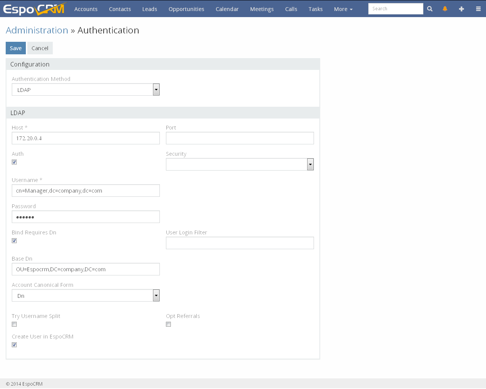
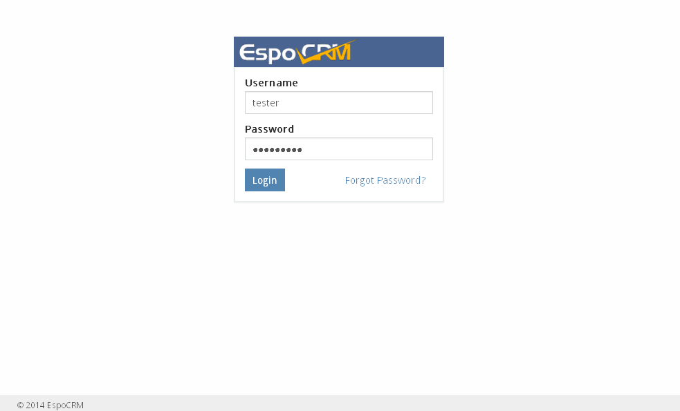

#Ldap Authorization

We will show how to configure LDAP authorization for EspoCRM. In our case we will use OpenLDAP server. Let’s go.

Go to OpenLDAP server and create a base DN for the EspoCRM users like
```
ou=Espocrm,dc=company,dc=com
```

Add a user `tester` inside the `ou=Espocrm` DN. So, the full DN for the user will be
```
cn=tester,ou=Espocrm,dc=company,dc=com
```

Then, go to EspoCRM  Authentication settings in the Administrator panel, select `LDAP` method and fill the LDAP details:



Where
* Host – LDAP IP or host name;
* Port – connection port;
* Auth – credentials for the LDAP server (Username, Password);
* Security – SSL or TSL protocol;
* Bind Requires Dn – if need to format the username in the DN form;
* User Login Filter – the group of users who will have possibility to use EspoCRM, e.g. `businessCategory=espocrm`, so all users who has defined this field with value `espocrm` in the LDAP server will use EspoCRM;
* Base Dn – the default base DN used for searching;
* Account Canonical Form – type of account canonical form. There are 4 options:
* Dn – the form in the format `CN=tester,CN=Espocrm,DC=company,DC=com`.
* Username – the form `tester`.
* Backslash – the form `COMPANY\tester`.
* Principal – the form `tester@company.com`.
* Try Username Split – if need to split a username with the domain.
* Opt Referrals – if referrals should be followed for the LDAP client;
* Create User in EspoCRM – if create a user in EspoCRM from the LDAP.

Now let's try to authenticate our `tester` user. Go to the login page and enter user credentials.



User has been authenticated and automatically created in the EspoCRM.

For more information about configuring LDAP you can read on the [Zend\Ldap library](http://framework.zend.com/manual/2.2/en/modules/zend.ldap.introduction.html) page, as EspoCRM uses this library.


