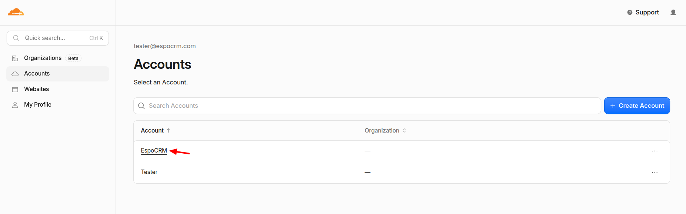
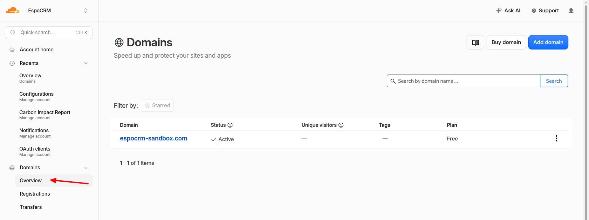
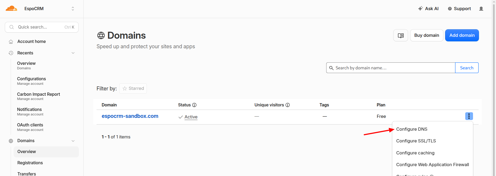
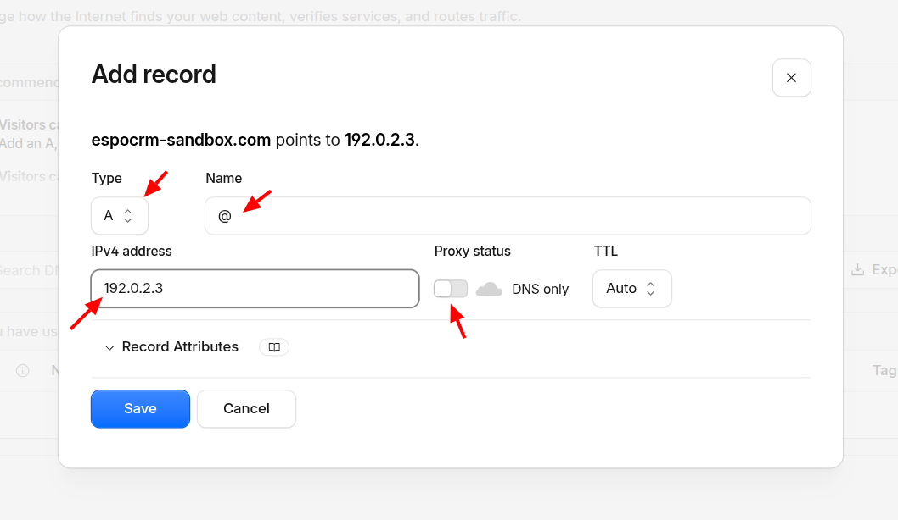

# DNS configuration

This guide explains how to configure DNS records for your domain and point them to the Public IPv4 address of your server using CloudeFlare.

1\. Select the account.

2\. Go to Domain section

3\. Go to DNS configuration

4\.  Define an IP address of your VPS server. If you are using a subdomain instead of the root domain, enter the subdomain name in the Name field instead of @. For example, enter crm to configure crm.example.com. The exact configuration may vary depending on your DNS provider.

