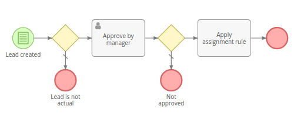
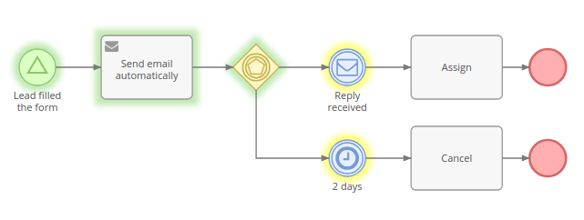

# Business Process Management

The Business Process Management (BPM) tool provides the ability to model and automate business processes in EspoCRM in a no-code/low-code way. The engine executes business processes described in BPMN 2.0 standard.

The BPM tool is available in [Advanced Pack](https://www.espocrm.com/extensions/advanced-pack/) extension.

### Difference from Workflows tool

The Workflows tool is intended for automation of simple business rules, w/o sequential flow items, when there is no need to display the flow graphically.

The BPM tool is intended for more complex business flows, where there can be diverging and converging flows, execution delays, user interactions. The flowchart view makes the business process more comprehensible for a human, a log allows to see how the process was held.

In this article:

* [Process Flowcharts](#process-flowcharts)
* [Processes](#processes)
* [Flowchart Elements](#flowchart-elements)
* [Conditions](#conditions)

## See also
* [Examples](bpm-examples.md)
* [Signals](bpm-signals.md)
* [Compensation](bpm-compensation.md)
* [BPM specific formula functions](bpm-formula.md)
* [Drip Email Campaign with BPM](bpm-drip-email-campaign.md)
* [Tracking URLs with BPM](bpm-tracking-urls.md)
* [Tips](bpm-tips.md)
* [Configuration](bpm-configuration.md)

## Process Flowcharts

The link to process flowcharts is available from the administration panel. It also can be added as a tab on the navigation panel.

Flowcharts are intended for business processes modeling. An administrator can create and edit flowcharts. Regular users can only view flowcharts.

Every flowchart has its specific entity type (specified by the *Target Type* field). The flowchart determines execution of future process instances. It comprises flowchart elements and connections between elements.

If the process flowchart has the unchecked 'Is Active' field then it won't initiate process instances.

To show details and parameters of a certain flowchart element you need to click on it. In the edit mode you will be able to edit parameters.

## Processes

Processes are available at the administration panel. The link also can be added as a tab on the navigation panel.

The process represents a business process instance. When it's initiated, it gets the status 'Started'. When the process is finished, it gets the status 'Ended'. 

The process is executed according to the flowchart. The flowchart of the process can't be changed after the process is started.

The process is obligatorily related to a single target record.

Processes can be **started**:

* Automatically – Upon specific conditions, signal, or scheduling, described in the flowchart; this is the main method.
* Manually – To start process manually, the user needs to click *Start Process* button on the list view of processes, or on the record detail view from the dropdown in the top-right corner.
* With Workflow rule – *Start BPM Process* action, it allows to pass a related record as a target for the process.

The execution of the process is visualized with colors highlighting flow nodes:

* green – processed;
* yellow – pending;
* violet – in process;
* gray – failed.

**Only one process** for the same target record and flowchart can be active **at the same time**. It means that if you have multiple start events, once one of them is triggered (the process is started), other start events will be ignored while the process is active. 

### Manipulating

A process can be **stopped manually** by a user who has 'edit' access to the process. You can do it from the dropdown menu next to the Edit button.

It's possible to **manually reject or interrupt** pending and active flow nodes. You can do it from the Log panel on the process detail view in the dropdown menu of a specific flow node. Note that after rejecting a flow node it's possible that the process will become suspended and won't ever end by itself. You will need either manually stop it or start a flow from any node to continue executing.

It's possible to **manually start a flow from any element** of an already started process. You need to click on a specific flowchart element on the process detail view and then click the button *Start flow from here*.

Ended, stopped and interrupted processes can be *reactivated* (from the dropdown next to the Edit button) (as of v2.14). After reactivation, the process does not have any active flow node. You need to manually start the flow from a specific flow node element. Ended sub-processes can be reactivated only if their parent process is active. Meaning that you might need to reactivate the parent process first.

### Self-removal

You can setup BPM process to remove itself. Add *Task* > *Update Process Record*. Add in formula: `deleted = 1;`.

### Access control

Only admin users can create or edit flowcharts. With roles it's possible to allow regular users to view flowcharts, view or edit processes. Note that a user needs also to have access to the Process Flowchart scope be able to view process flowchart details. 

## Flowchart Elements

See more detail in separate articles:

* [Events](bpm-events.md)
* [Gateways](bpm-gateways.md)
* [Activities](bpm-activities.md)

### Events

Events represent something that happens during a business process. They also start, end and interrupt the process flow. Depicted as a circle.

### Gateways

Gateways diverge and converge flows. Depicted as a yellow diamond.

### Activities

Automated tasks, manual tasks and sub-processes. Represented as a gray rectangle.

### Flows

#### Sequence Flow

Represented as a solid arrow. It indicates the order in which process elements will be executed.

## Conditions

Conditional events, exclusive and inclusive diverging gateways have conditions that determine the flow of the process.

Through the UI there is the ability to check conditions for the following records:

* Target record;
* Records related to the target through many-to-one and children-to-parent relationships;
* Records created by the process via tasks;
* User task records, which allows checking the resolution.

It's also possible to define conditions with [formula](formula.md) expressions. Example: `status == 'New'`. 

Conditions in the BPM tool are the same as in the Workflow tool. See more details about [workflow's conditions](workflows.md#conditions).
