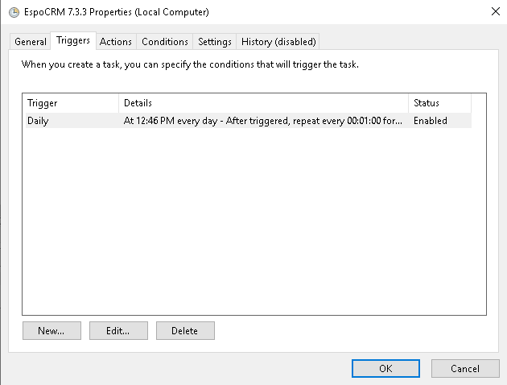
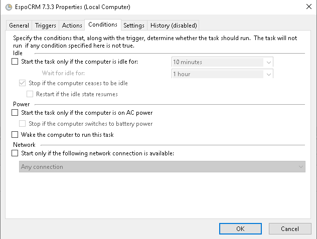
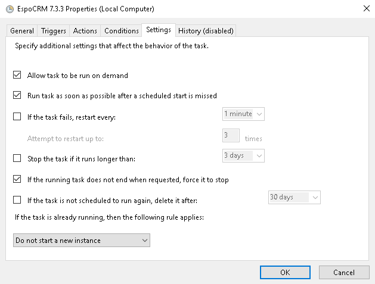

# Setting up Cron on Windows

!!! note

    All configuration settings listed here are made on **Windows Server 2019**.

To setup crontab on Windows system, take the following steps:

1\. Login as administrator into your EspoCRM instance.

2\. Go to the Scheduled Jobs section in the administrator panel (Menu > Administration > Scheduled Jobs) and copy the string for the crontab, replace  `php.exe` instead of `php-cgi.exe` and add `"` symbols to the start and the end of the `php.exe` path. It looks like this one:

```
"C:\Program Files\PHP\v8.2\php.exe" -f C:\inetpub\wwwroot\733\cron.php
```

3\. Create a batch file by using Notepad and save with the *.bat* extension with string from step 2.

4\. From the Windows Start menu, select Administrative Tools and then Task Scheduler.

5\. Create a folder inside Windows directory and Task inside.

6\. Configure the Task with the following settings and click `OK`:









7\. Right-click on the created Task and Click on `Run`.

