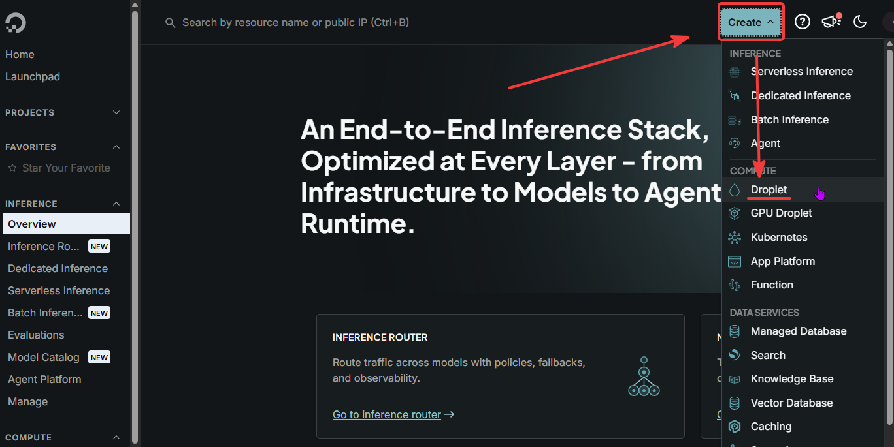
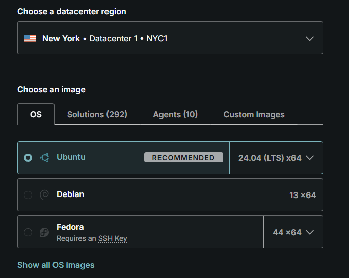
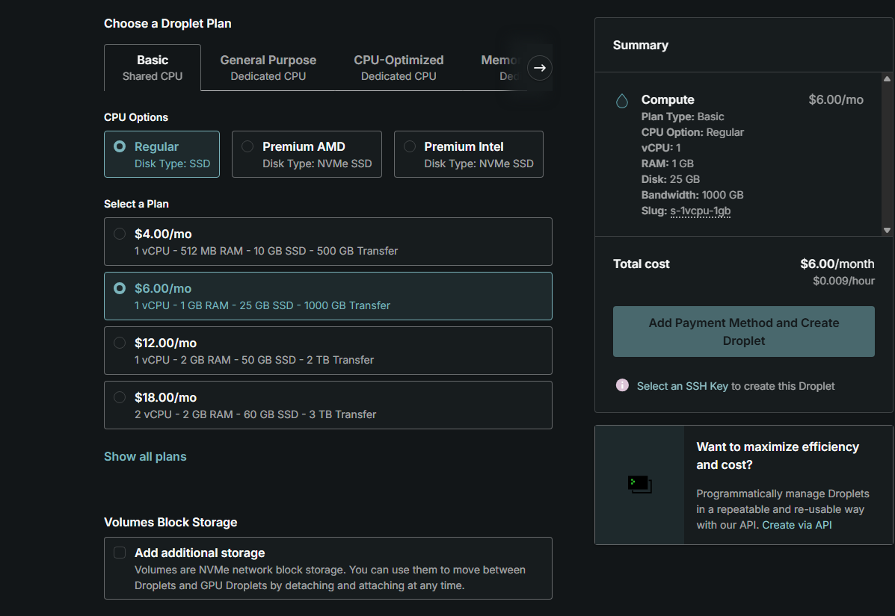
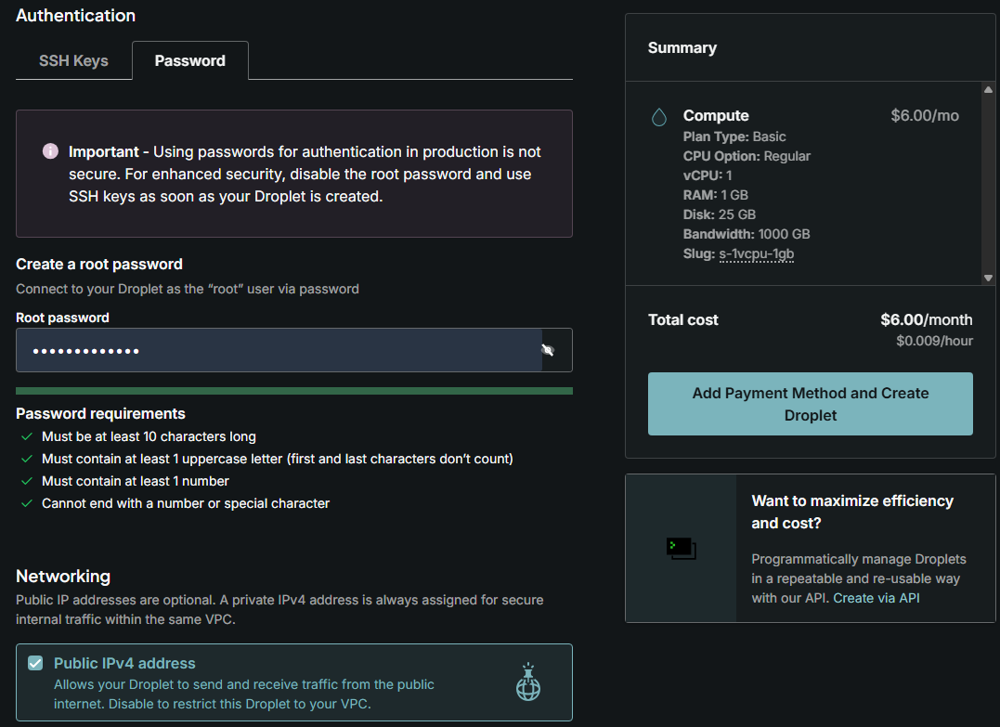
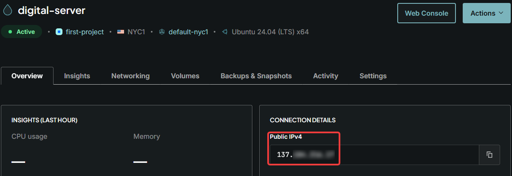
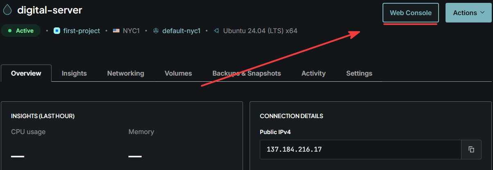
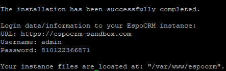

# DigitalOcean and EspoCRM

DigitalOcean is a cloud platform that provides scalable infrastructure, including virtual servers (Droplets), storage, networking, and other cloud services. In this guide, we will use a DigitalOcean Droplet to deploy and run a self-hosted EspoCRM instance.

1. Sign up on the [official DigitalOcean website](https://cloud.digitalocean.com/registrations/new)

2. Create a Droplet



3. Choose a datacenter region that is convenient for you. The recommended OS is Ubuntu or Debian.



4. We recommend a Droplet plan with at least 1 GB of RAM.. Higher plans may provide a smooother user experience.



5. Attach an SSH key or create a password, although using a password provides lower security. Add Payment Method and complete the Droplet creation.



> [!NOTE]
> At this step, you can proceed with registeting a domain on any preffered domain provider and bind it to the Public IPv4 address shown in the Droplet menu.



6. Now, log in to your server using the "Web Console" button or any other convenient way (e.g., a terminal) as the root user.



7. Right after you log in to your server you can already download the installation script and run it with a singlt command:
```
wget -N https://github.com/espocrm/espocrm-installer/releases/latest/download/install.sh
sudo bash install.sh
```
During installation process, the system will prompt you to choose appropriate SSL protocol and enter a domain name, if available.

It's also possible to run the installer with all necessary preset, for example:
```
wget -N https://github.com/espocrm/espocrm-installer/releases/latest/download/install.sh
sudo bash install.sh -y --ssl --letsencrypt --domain=my-espocrm.com --email=email@my-domain.com
```

All available prompt options can be foud [here](installation-by-script.md#available-options)

After a successful installation, the login credentials, including the URL that you can use to access EspoCRM, will be shown in the terminal.



# Fail2ban

Fail2Ban is a security tool that monitors system logs for repeated failed authentication attempts and temporarily blocks suspicious IP addresses. It helps protect the server against brute-force attacks.

The following steps demonstrate how to install and check that Fail2Ban is correctly configured on your server.

1. Install
```
sudo apt update
sudo apt install fail2ban -y
```
2. Create the SSH jail configuration
Create the file:
```
sudo nano /etc/fail2ban/jail.d/sshd.local
```
Add the following configuration:
```
[sshd]
enabled = true
port = ssh
filter = sshd
backend = systemd

findtime = 10m
maxretry = 5
bantime = 1h
```
3. Test the configuration
Run:
```
sudo fail2ban-client -t
```
You should see:
```
OK: configuration test is successful
```
4. Restart Fail2Ban
```
sudo systemctl restart fail2ban
sudo systemctl enable fail2ban
```
5. Check the jail
```
sudo fail2ban-client status
```
Check SSH jail details:
```
sudo fail2ban-client status sshd
```
