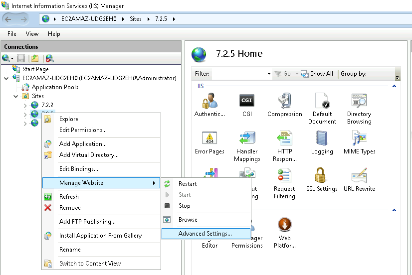
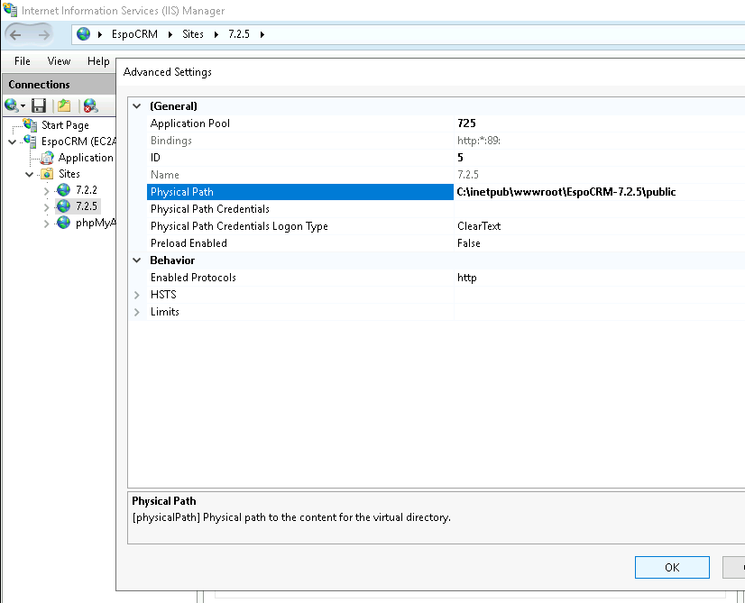
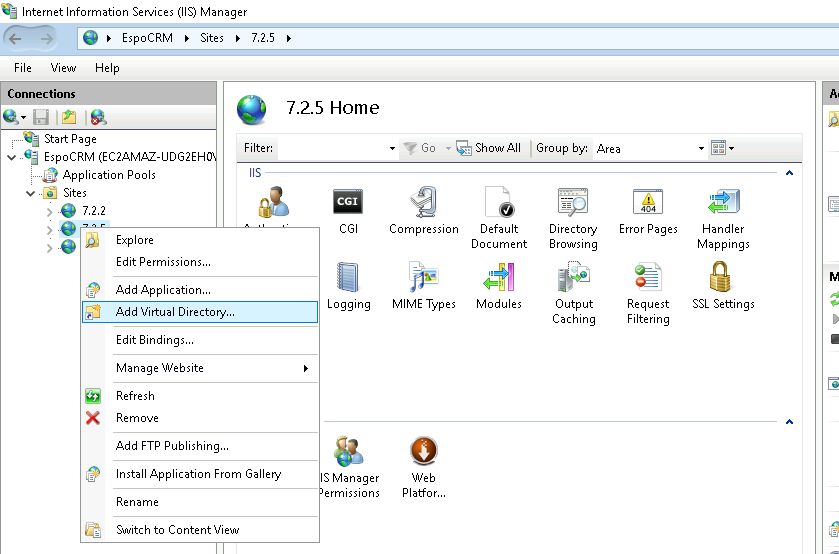
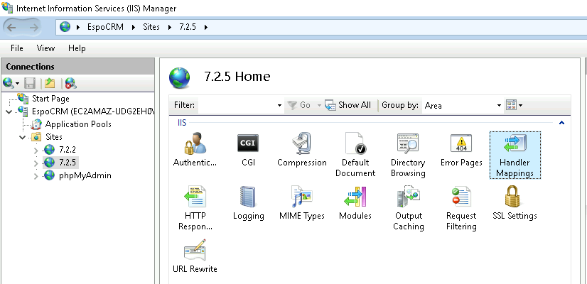
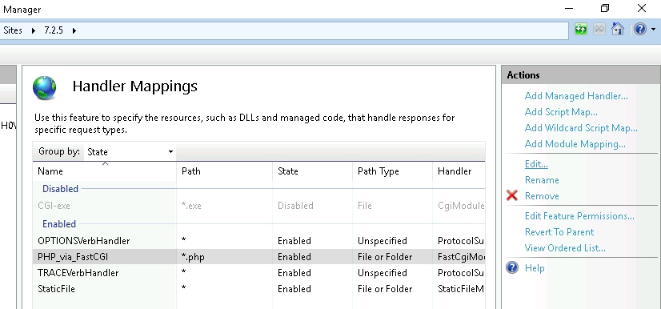
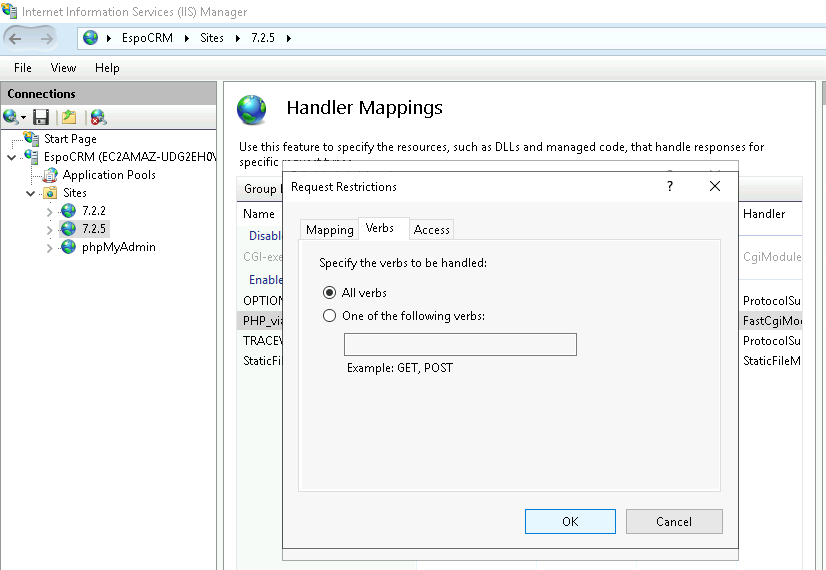

# IIS server configuration for EspoCRM v7

These instructions are supplementary to the [server configuration](server-configuration.md) guidelines. Note that all configuration settings listed here are made on Ubuntu server.

Note that all configuration settings listed here are made on **Windows Server 2019**.

# To completely сonfigure IIS server for smooth EspoCRM v7 operation please do the following steps:

## Step 1. Physical Path adjusting

1.1. Go to **IIS Manager**, select your *Site*.

1.2. Right-click on *Site* > *Manage Website* > *Advanced Settings*.

1.3. Specify your EspoCRM public directory path (e.g., `C:\inetpub\wwwroot\EspoCRM-7.2.7\public`) in the *Physical Path* field.

1.4. Click on *OK*.

## Step 2. Virtual Path adjusting

2.1. Right-click on *Site* in **IIS manager** > *Add Virtual Directory*.

2.3. Type *client* name in the *Alias* field.
2.4. Specify your EspoCRM client directory path (e.g., `C:\inetpub\wwwroot\EspoCRM-7.2.7\client`) in the *Physical Path* field.
2.5. Click *OK*.

## Step 3. Handler Mappings settings

### Via IIS Manager

3.1. Navigate **Handler Mappings** scope of your *Site*.

3.2. Select *PHP_via_FastCGI* module > *Actions* > *Edit*.

3.3. Specify `"C:\Program Files\PHP\v7.4\php-cgi.exe"` path in the *Executable (Optional)* field (***double quotes are required***).

3.4. Navigate *Request Restrictions* > *Verbs*.
3.5. Specify the verbs to be handled. Select `All verbs` or specify *One of the following verbs:* `GET,HEAD,POST,PUT,DELETE,PATCH`, click on *OK*.

3.6. Click on *OK* and *Yes*.

### Via Text Editor (Notepad as Administrator, Sublime Text, VSCode, etc.)

3.1. Open **%windir%\system32\inetsrv\config\applicationhost.config** file.
3.2. Locate the *< handlers >* tag.
3.3. Locate **"PHP_via_FastCGI"** section, add all HTTP methods modifiyng `verb="GET,HEAD,POST"` value to `verb="GET,HEAD,POST,PUT,DELETE,PATCH"`.
3.4. Save the **ApplicationHost.config** file.

**Reboot your IIS server after all the steps are done.**

