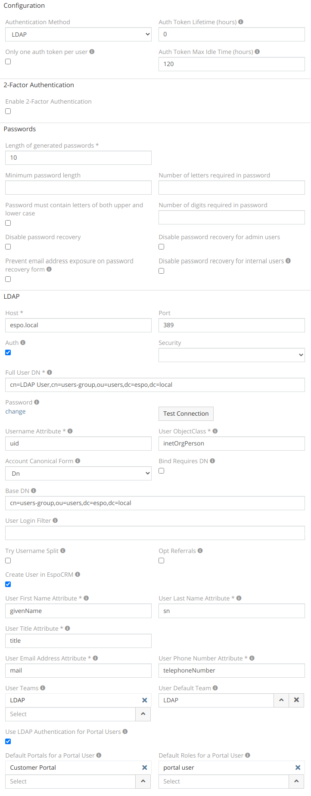

# LDAP authorization for OpenLDAP

Example of configuration LDAP authorization for OpenLDAP server. The full guide to configuring LDAP authorization is described [here](ldap-authorization.md).

- Host: `espo.local`
- Port: `389`
- Full User DN: `cn=LDAP User,cn=espo-users,ou=users,dc=espo,dc=local`
- Password: `******`
- Username Attribute: `uid`
- User ObjectClass: `inetOrgPerson`/ `person`
- Account Canonical Form: any of available `Dn`/`Username`/`Backslash`/`Principal`
- Bind Requires DN: `yes`
- Base DN: `cn=espo-users,ou=users,dc=espo,dc=local`
- Create User in EspoCRM: `yes`
- User First Name Attribute: `givenName`
- User Last Name Attribute: `sn`
- User Title Attribute: `title`
- User Email Address Attribute: `mail`
- User Phone Number Attribute: `telephoneNumber`

