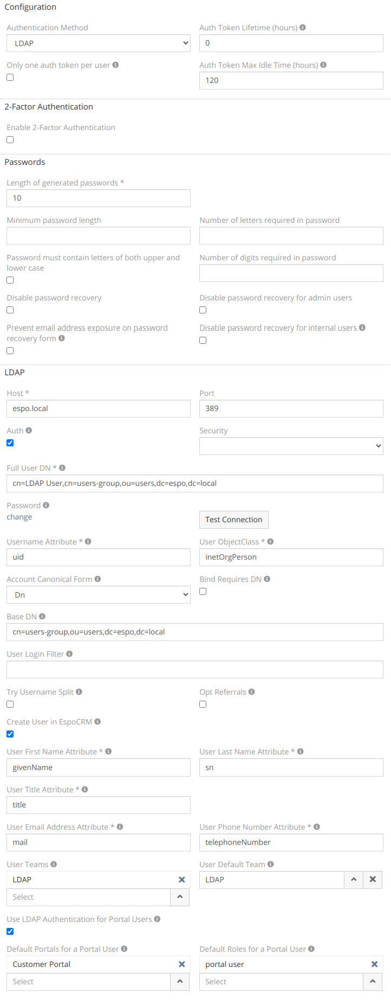

# LDAP Authorization

* [LDAP configuration](#ldap-configuration)
* [Active Directory configuration](ldap-authorization-for-ad.md)
* [OpenLDAP configuration](ldap-authorization-for-openldap.md)
* [Troubleshooting](#troubleshooting)

## LDAP configuration

In this guide, we will show how to configure LDAP authorization for EspoCRM. Let’s go.

Go to your LDAP server and create a base DN for the EspoCRM users like:
```
cn=espo-users,ou=users,dc=espo,dc=local
```

We have to create a system user that will have access to the users DN (“cn=espo-users,ou=users,dc=espo,dc=local”). So, the full DN for this system user will be:
```
cn=LDAP User,cn=espo-users,ou=users,dc=espo,dc=local
```
Now, we can add LDAP user to access EspoCRM. E.g. Espo Tester with the username “tester” inside the “cn=espo-users,ou=users,dc=espo,dc=local” DN. Note: to be able to use this login format for EspoCRM, you have to specify the “Username Attribute” and “Base DN” options.

Then, go to EspoCRM Authentication settings in the Administrator panel, select the `LDAP` method and fill in the LDAP details:



* Host – LDAP IP or host name.
* Port – connection port.
* Auth – access credentials for the LDAP server:
* Full User DN – the full system user DN which allows to search other users.
    * Password – the password to access the LDAP server.
    * Security – SSL or TSL protocol.
* Username Attribute – The attribute to identify the user.
E.g. for Active Directory: "userPrincipalName" or "sAMAccountName",for OpenLDAP: "uid" .
* Account Canonical Form – the type of your account canonical form. There are 4 options:
    * `Dn` – the form in the format `CN=tester,CN=Espocrm,DC=company,DC=com`.
    * `Username` – the form `tester`.
    * `Backslash` – the form `COMPANY\tester`.
    * `Principal` – the form `tester@company.com`.
* User ObjectClass – ObjectClass attribute for searching users. E.g. for Active Directory: "person", for OpenLDAP: "inetOrgPerson".
* Bind Requires Dn – if there is a need to format the username in the DN form.
* Base Dn – the default base DN which is used for searching users.
* User Login Filter – the filter which allows to restrict users who are able to use EspoCRM. E.g. `memberOf=cn=espoGroup,cn=espo-users,ou=users,dc=espo,dc=local`.
* Try Username Split – the option to split a username with the domain.
* Opt Referrals – if referrals should be followed to the LDAP client.
* Create User in EspoCRM – this option allows EspoCRM to create a user from the LDAP.
* User First Name Attribute – LDAP attribute which is used to determine the user’s first name.
* User Last Name Attribute – LDAP attribute which is used to determine the user’s last name.
* User Title Attribute – LDAP attribute which is used to determine the user title.
* User Email Address Attribute – LDAP attribute which is used to determine the user’s email address.
* User Phone Number Attribute – LDAP attribute which is used to determine the user’s phone number.
* User Teams – Teams for created user. For more, see user profile.
* User Default Team – Default team for created user. For more, see user profile.
* Use LDAP Authentication for Portal Users – Allow portal users to use LDAP authentication instead of Espo authentication.
* Default Portals for a Portal User – Default Portals for created Portal User.
* Default Roles for a Portal User – Default Roles for created Portal User.

!!! note

    For the **first** LDAP user login (both system and portal) the `Create User in EspoCRM` parameter should be checked. Otherwise it won't be able to login.

Now, go to the login page and enter user credentials.


User has been authenticated and automatically created in the EspoCRM.

## Troubleshooting

### Error: 0x31 (Invalid credentials; 80090308: LdapErr: DSID-0C09041C, comment: AcceptSecurityContext error, data 52e, v4563)

This error occurs when the wrong `Account Canonical Form` or `Username Attribute` are specified.
The correct values are:
- Account Canonical Form: `Principal` or `Username`. 
- Username Attribute: `sAMAccountName`

The full Active Directory configuration, see in the [documentaion](ldap-authorization-for-ad.md).
