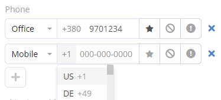

# Phone Numbers

## Internaltional phone numbers

The internaltional phone numbers functionality can be enabled or disabled at Administration > Settings. When enabled, all phone number values are stored in the international format, e.g. *+111111111111*.

Features:

* A user is able to select country code when entering a number in a phone number field.
* The appropriate formatting is applied when a phone number is displayed.
* Validation is applied when saving a phone number, not allowing to save a not valid number.

It is possible to define preferred country codes at Administration > Settings. This will avoid the need to enter the same country code when operating in a specific region.

When importing records, there is the ability to specify a regional telephone code, so that import values in a regional format will be automatically converted to international. The same functionality exists for the Lead Capture feature.

