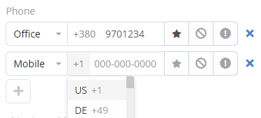

# Phone Numbers

## International phone numbers

The international phone numbers functionality can be enabled or disabled at Administration > Settings. When enabled, all phone number values are stored in the international format, e.g. *+111111111111*.

Features:

* A user is able to select country code when entering a number in a phone number field.
* Appropriate formatting is applied when a phone number is displayed.
* Validation is applied when saving a phone number, not allowing to save a not valid number.

It is possible to define preferred country codes at Administration > Settings. This will avoid the need to enter the same country code when operating in a specific region.

When importing records, there is the ability to specify a regional telephone code, so that values in a regional format will be automatically converted to international. The same functionality exists for the Lead Capture feature.

## Numberic search

Numeric search for phone numbers is enabled by default. It allows you to search for phone numbers using only digits, without dashes or the + sign.

Can be enabled or disabled with the parameter: Administration > Settings > General > Numeric phone number search.

## Text filter and Global Search

Whether phone numbers are searched by the system in [Text Filter](../user-guide/text-search.md#list-view-text-search) or [Global Search](../user-guide/text-search.md#global-search) is controlled per entity type by the following parameter: Administration > Entity Manager > {Entity Type} > Edit > Text Filter Fields. The Phone Number field must be added to the list.
