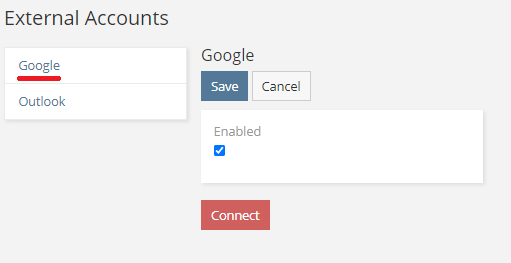
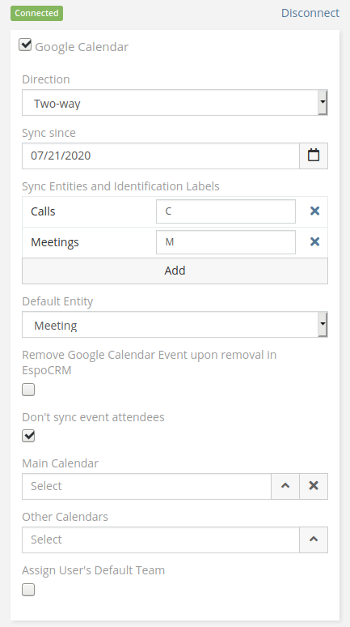

# Google Integration. Calendar sync

!!! note

    Before proceeding to this article, it's recommended to [set up the integration](setting-up.md).

[Google Integration](https://www.espocrm.com/extensions/google-integration) provides the ability to sync calendar events in both directions.

Features:

* The ability to monitor multiple calendars.
* Syncing since specified date.
* Syncing attendees.
* The ability to choose what event types to sync.
* Private events are not synced.

## Setting-up for users

Assuming that the administrator has already set up the integration.

Go to your user detail view (the menu on the very top-right corner > click on your user name). Then click *External Account* button.

Click *Google* on the left panel, check *Enabled* checkbox and then click *Connect* button.

A popup will show up asking for a user consent.

If everything went fine, a green label *Connected* should show up.

!!! important

    If you connected successfully, but *Google Calendar* checkbox didn't show up, that means that the administrator did not grant you access to *Google Calendar* scope.

Check *Google Calendar* checkbox and configure sync parameters.

After that, you need to click *Save*.

## Parameters

* Direction – a type of sync. Possible types: *One-way: EspoCRM to Google*, *One-way: Google to EspoCRM*, and *Two-way*.

* Sync since – events created or modified after a specified date will be synced.

* Sync Entities and Identification Labels – types of entities you want to sync. For type recognizing, the event name has to start from the identification label. Label for default entity can be empty. Recommendation: Do not change identification labels after the sync has already happened.

* Default Entity – by default, events will be synced as entities of a selected type.

* Remove Google Calendar Event upon removal in EspoCRM – if you create an event in Google Calendar, you can not delete it from EspoCRM (if you delete it in CRM, this event won’t be deleted in Google Calendar). If you check this box, it will allow to delete Google event from EspoCRM as well.

* Don’t sync event attendees.

* Main Calendar – all new events from EspoCRM will be created in this calendar (actual for *One-way: EspoCRM to Google* or *Two-way*).

* Other Calendars – other calendars to monitor.

* Assign User's Default Team - a user default team will be auto-assigned to an event synced from Google Calendar to EspoCRM (see the `Default Team` parameter in a user's profile).

## Misc

If you Espo entity type has a  *Varchar* or *Text* field named `location`,  it will be synced with the Google Calendar's location.
