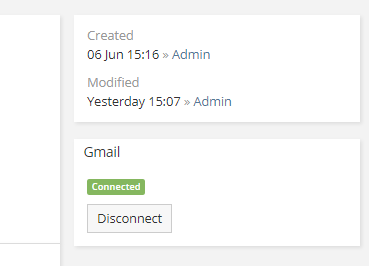

# Google Integration. Gmail

!!! note

    Before proceeding to this article it's recommended to [set up the integration](setting-up.md).

Gmail Secure Authentication is available in [Google Integration](https://www.espocrm.com/extensions/google-integration) extension. It provides a secure authentication for Gmail accounts via OAuth2. With this extension, you won’t need to store your Gmail password in EspoCRM and enable access for less secure applications in your Google Account settings.

Note: Using in personal email accounts requires 5.9.2 version or later. Using in group email accounts requires 5.8.0 version or later.

## Setting-up email account

Assuming that the administrator has already set up the integration.

Create a personal or group email account. Specify IMAP and SMTP parameters for Gmail (hosts: `imap.gmail.com` & `smtp.gmail.com`). Leave *Password* fields empty. Then, save the record.

After that, *Gmail* panel should appear on the right. You need to click *Connect* button. A popup will show up asking for a user consent.

!!! note

    You need to be logged in to Google as a user to which an email address of the current email account record belongs. For example, if you configure email account for *example@gmail.com*, you need to log in to Google as a user who has *example@gmail.com* email address.

After that, you can test imap connection and sent test email to make sure everything works fine.
