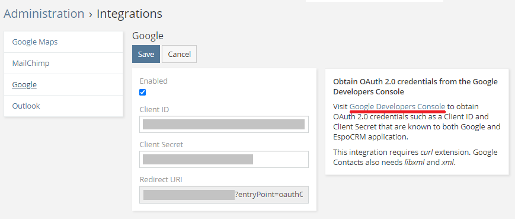
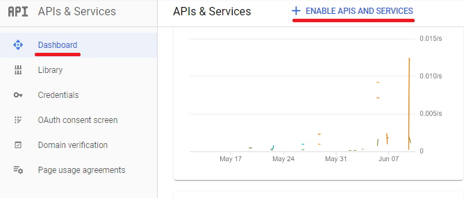
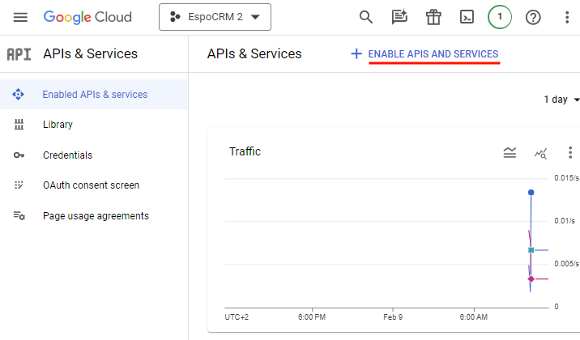
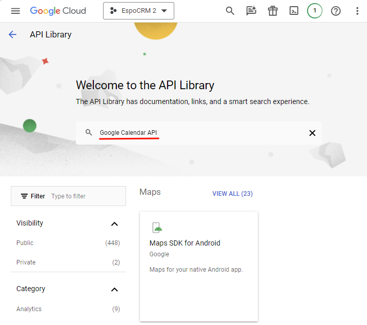
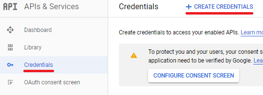
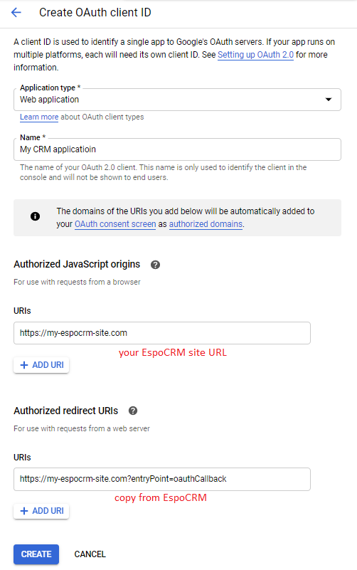
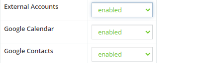

# Google Integration. Setting-up for Administrator

Note that the integration requires curl, libxml and xml PHP extensions installed. If any is not installed, you will be notified after saving.

* [Integration](#integration)
* [Access control](#access-control)

## Integration

Go to the Administration > Integrations > Google. Check *Enabled* checkbox.

* You will obtain *Client ID* and *Client Secret* in Google Developers Console.
* You will need to copy *Redirect URI*  to Google Developers Console.

Do the following steps.

**1\.** Go to the [Google Developers Console](https://console.developers.google.com/).

**2\.** Create a new project, or select an existing one.

**3\.** Enable needed APIs.

From the Navigation menu, click *APIs & Services* > *Enabled APIs & services*.

Then, click *+ ENABLE APIS AND SERVICES*.

On the API Library page, use search to find the relevant APIs:

* Google Calendar API (for Calendar sync);
* Google People API (for Contacts pushing);
* Gmail API (for secure connection to Gmail).

Enable the APIs that you need to use in your CRM. Note that some APIs can be already enabled.

**4\.** Configure consent screen.

To create an OAuth client ID, you must first configure your OAuth consent screen. Go to OAuth consent screen and follow the instructions on the page.

**5\.** Create credentials.

On the *Credentials* page, click *CREATE CREDENTIALS*, select *OAuth client ID*.

Select 'Web application' in *Application type* field. Add your site URL in *Authorized JavaScript origins*. Add *Redirect URI* (copied from EspoCRM integration panel) to *Authorized redirect URIs*.

**6\.** Find *Client ID* and *Client secret*. Copy them to EspoCRM integration panel and save.

## Access control

**Important**: By default, regular users don’t have access to Google Calendar and Contacts integrations. Administrator needs to enable access in Roles. The following scopes need to be enabled:

* External Accounts;
* Google Calendar;
* Google Contacts.

