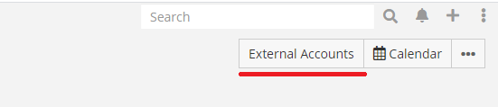
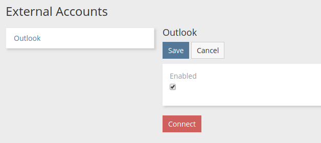
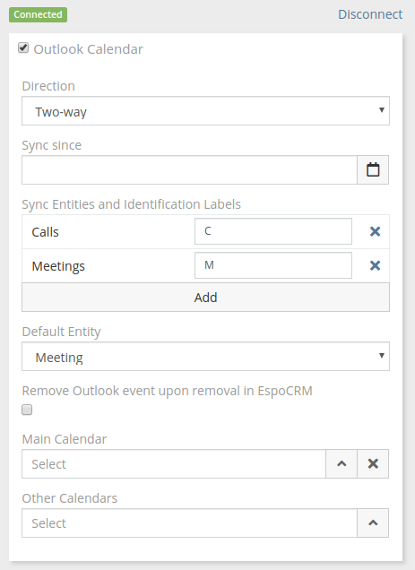

# Outlook Integration. Calendar

!!! note

    Before proceeding to this article it's recommended to [set up the integration](setting-up.md).

Outlook Calendar Sync is available in the [extension](https://www.espocrm.com/extensions/outlook-integration/).

Features:

* Meetings, Calls, custom entities of Event type can be synced from EspoCRM to Outlook.
* Attendees are synced from Outlook to EspoCRM as Contacts, Leads, and Users.

Three modes of sync are supported:

* Outlook to EspoC
* Espo to Outlook
* Both

Limitations:

* Attendees are not synced from Espo to Outlook.
* Outlook recurring activities are not synced to Espo.
* *Description* field is not synced back from Outlook to Espo if an event was created in Espo.
* Events created in Espo won't be removed in Espo on removal in Outlook. A measure to overcome a bug in Outlook that could cause unwanted event removals.

## Setting up for users

Assuming, that the administrator has already set up the integration.

Go to your user detail view (the menu on the very top-right corner > click on your user name). Then, click *External Account* button.

Click *Outlook* on the left panel, check *Enabled* checkbox and then click *Connect* button.

A popup will show up asking for a user consent.

If everything went fine, a green label *Connected* should show up.

**Important**: If you connected successfully, but *Outlook Calendar* checkbox didn't show up, that means that the administrator did not grant you access to *Outlook Calendar* scope.

Check *Outlook Calendar* checkbox and configure sync parameters.

After that, you need to click *Save*.
