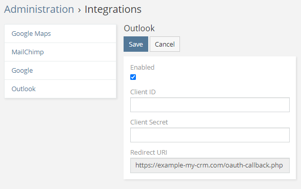
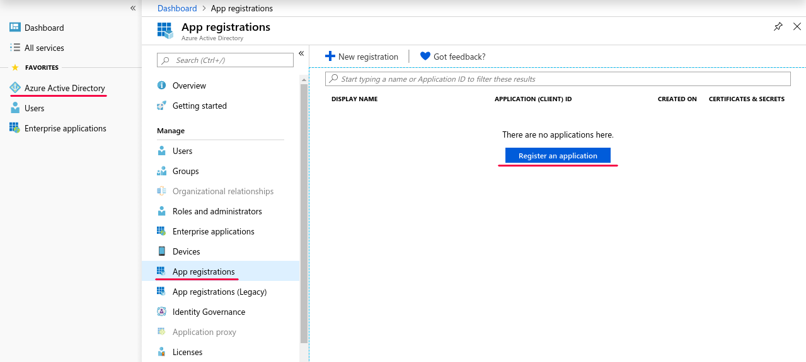
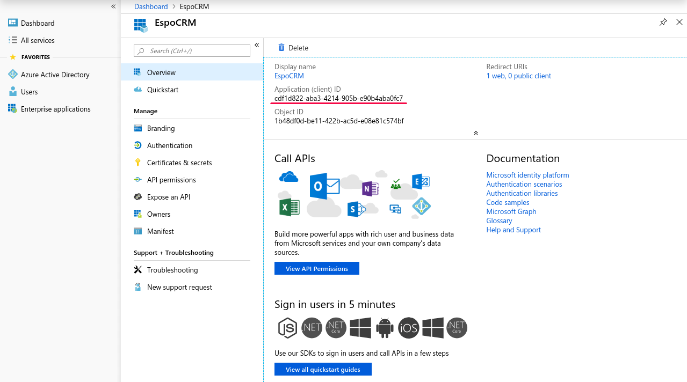
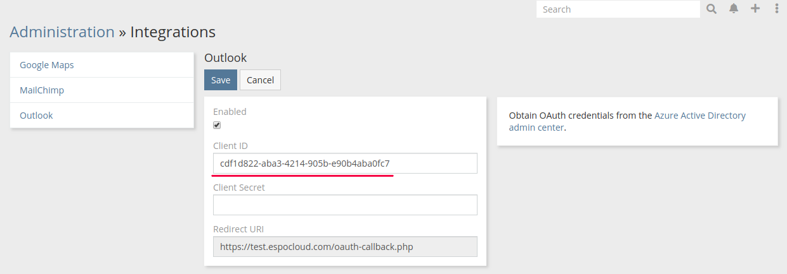
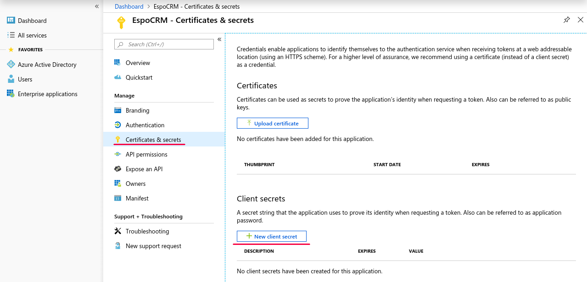
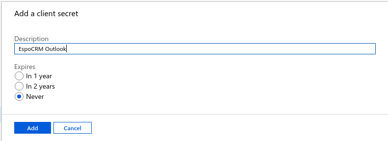
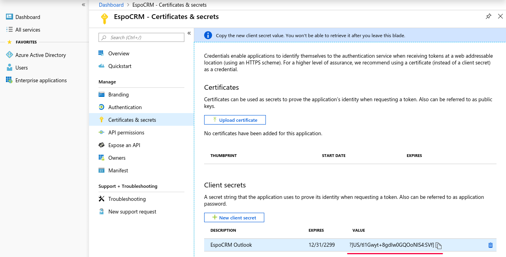
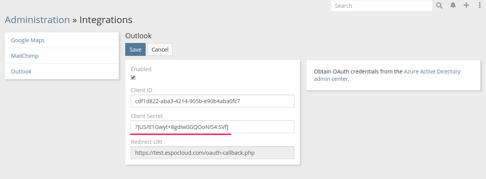
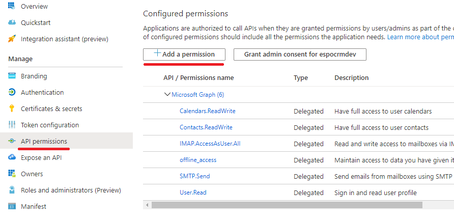
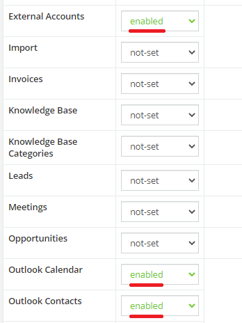

# Outlook Integration. Setting-up for Administrator

* [Integration](#integration)
* [Access control](#access-control)
* [Sync scheduling](#sync-scheduling)
* [Troubleshooting](#troubleshooting)

## Integration

Go to the Administration > Integrations > Outlook. Check *Enabled* checkbox.

* You will obtain *Client ID* and *Client Secret* in Azure Active Directory admin center.
* You will need to copy *Redirect URI* to Azure Active Directory admin center.

**1\.** Go to [aad.portal.azure.com](https://aad.portal.azure.com).

**2\.** Create an application.

Follow Azure Active Directory > App registration > Register an application.

Select needed *Supported account types*.

Copy *Redirect URI* from EspoCRM. Note, that type should be set to `Web`.

**3\.** Copy *Application (client) ID* from Azure app to EspoCRM.

**4\.** Create a secret for Azure app. Copy it to EspoCRM.

If the *Never* option is not available, choose *In 2 years*. In this case you will need to re-generate the secret in 2 years.

**5\.** Save Outlook integration credentials in EspoCRM.

**6\.** Grant required permissions for Azure app.

!!! note

    This step is required for Microsoft 365 users. For Outlook.com, it usually works without this step, but it might be needed either.

Click *Api Permissions* on the left panel. Click *Add a permission*. Click *Microsoft Graph*. Click *Delegated permissions*. Then, use search to find the needed permissions and enable them.

Permissions that need to be enabled:

* offline_access – mandatory;
* Calendars.ReadWrite – optional – for calendar sync;
* Contacts.ReadWrite – optional – for contacts pushing;
* IMAP.AccessAsUser.All – optional – for email fetching;
* SMTP.Send – optional – for email sending.

After adding the above listed API permissions, click Grant Admin Consent for (your organization).

!!! note

    The Site URL should be configured properly in EspoCRM – it should be the URL address used to access your CRM instance. Otherwise, the integration will not work. The parameter is available under: Administration > Settings > Site URL.

## Access control

**Important**: By default, the regular users don’t have access to Outlook Calendar integration. Administrator needs to enable access in Roles. The following scopes need to be enabled:

* External Accounts;
* Outlook Calendar;
* Outlook Contacts.

## Sync scheduling

Sync is run by the scheduled job *Outlook Calendar Sync*. By default, it is executed every 10 minutes. You can change scheduling at Administration > Scheduled Jobs > Outlook Calendar Sync.

## Troubleshooting

Check whether the scheduled job is running Administration > Scheduled Jobs > Outlook Calendar Sync > Log.

Check EspoCRM log at `data/logs` directory. You can also set the [log mode](../../administration/troubleshooting.md#debug-mode) to `DEBUG` level to obtain more info from the log.

## Microsoft 365 configuration

### Enabling SMTP

For Microsoft 365, you might need to enable SMTP AUTH for specific mailboxes. See how to do it in the [Microsoft documentation](https://docs.microsoft.com/en-us/exchange/clients-and-mobile-in-exchange-online/authenticated-client-smtp-submission#use-the-microsoft-365-admin-center-to-enable-or-disable-smtp-auth-on-specific-mailboxes).
