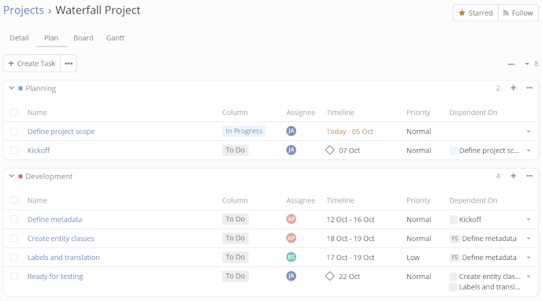
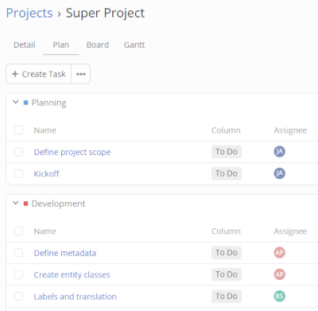
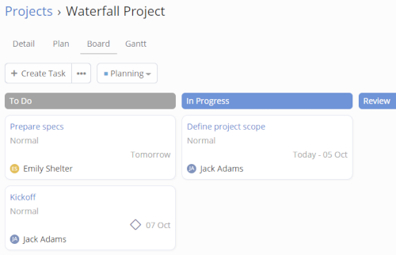
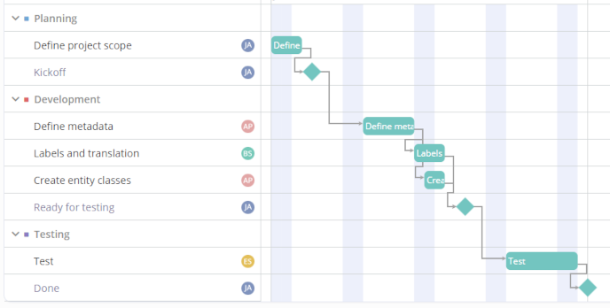

# Projects

The Projects functionality is available in the [Project Management](https://www.espocrm.com/extensions/project-management/) extension.

In this arcticle:

* [Projects](#projects)
* [Boards](#boards)
* [Access control](#access-control)
* [Tasks](#tasks)
* [Milestones](#milestones)
* [Groups](#groups)
* [Plan view](#plan-view)
* [Board view](#board-view)
* [Gantt view](#gantt-view)
* [Project cloning](#project-cloning)

## Projects

The Projects list view is available from the Projects tab in the navigation bar. Here you can create a new Project.

A project owner can manage the project team by adding or removing members (Users) and changing their roles in the project.

Each Project has a Stream. It can be used to post information or attach files. Project updates are automatically posted in the Stream.

A Project has Activities and History panels. Meetings, Calls, and Emails can be related to a Project.

## Boards

A Project Board defines board Columns for a Project. The *Board* field is mandatory in a Project. It can be set only when you create a Project. Multiple Projects can use the same Project Board.

Each Column is mapped to a specific Status value. Multiple Columns can be mapped to the same status. For example, the *In Progress* and *Review* columns are mapped to the status *Started*.

Available statuses:

* Not Started
* Started
* Completed
* Canceled
* Deferred

A Task in a Project is usually assigned to a specific Column. When a Column is changed, the Task's status is automatically changed to a mapped status.

The *Default* Project Board is available out of the box. You can create new Project Boards. When you create a Project Board, default Columns are automatically added. You can rename the Columns or add new ones.

## Access control

Access control for Projects is managed by Roles and project-level roles.

### Roles

To be able to access Projects, a user must have the *Project* scope enabled in Roles. For minimum access, set: create = no, read = own, edit = no, delete = no.

To be able to create Projects, a user must have *Create* access for the Project scope and *Read* access for the Project Board scope.

### Project-level Roles

A project owner or a user with *Edit* access can manage project members. Each member has a specific project-level Role.

Built-in roles:

* Owner – can edit the Project; can manage members; can create and edit Tasks;
* Editor – can edit the Project; can create and edit Tasks;
* Member – can view Tasks assigned to them; can move assigned Tasks between Columns; can edit Tasks they own.

The admin can create custom Project Roles. The Project Roles list view is available at: the Project list view > the dropdown menu in the top-right corner > Roles.

Project Roles allow fine-grained access control.

A Project Role defines the following Task related actions and levels:

* Create – yes/no – can create Tasks;
* Assignment – all/own – whom can assign Tasks to;
* Read – all/own – what Tasks can view;
* Stream – all/own – access to the Tasks's Stream;
* Edit – all/assigned/own – what Tasks can edit;
* Column Edit – all/assigned/own – what Tasks can move on the board;
* Delete – all/own/no – what Tasks can delete.

## Tasks

In the Project Management tool, a Task is represented by the *Project Task* entity type.

A Project can have multiple Tasks. Tasks can belong to different Groups. Tasks can be re-ordered within a Group. Tasks are also placed in specific Columns of the Board.

Tasks can have Sub-tasks.

### Status

Available Task statuses:

* Not Started
* Started
* Completed
* Canceled
* Deferred

The Status field is read-only: it cannot be edited explicitly. The status is updated automatically after changing the Column value (moving the Task on the Board) and when completing or canceling the Task.

### Column

The *Column* field indicates in which column a Task is placed on the Board. It also defines the Status of the Task.

The available Columns in a Project are defined by the assigned Project Board.

A project member with the *Member* role has access to update the Column field.

### Group

The *Group* field defines in what Group a Task is placed in.

When creating a new Task, the *Active Group* of the Project is pre-selected.

### Task dependencies

A Task can be dependent on multiple Tasks.

There are the following dependency types:

* Finish to Start – the predecessor must be finished before the successor can be started;
* Finish to Finish – the predecessor must be finished before the successor can be finished;
* Start to Start – the predecessor must be started before the successor can be started;
* Start to Finish – the predecessor must be started before the successor can be finished.

The dependency type can be omitted: in this case, the dependency will be only declarative but not required. Meaning, it will be possible to finish a successor Task regardless of the predecessor's status.

The default dependency type can be set at: Administration > Entity Manager > Project Task > Fields > Dependency Type.

The label color indicates the predecessor's task status. Gray – Not Started, Blue – Started, Green – Completed.

### Owner

The Task's Owner is a User who oversees the Task. A User who created a Task automatically becomes the Task's Owner.

### Assignee

The Assignee of a Task is a User who is responsible for performing the Task. A Task can be unassigned.

### Timeline

A Task can have a Date Start and Date End. Both are non-mandatory fields.

### Points

Is meant to represent the relative complexity of the Task, amount of work needed to complete the Task.

Note that if the team won't use Points, the administrator can hide the field in the Entity Manager.

### Hours

May represent how many hours is required to complete the Task.

### Sub-tasks

A Task can have sub-tasks. A task that has sub-tasks can be completed only when all sub-tasks are completed or canceled.

Sub-tasks can be owned by and assigned to different Users.

Sub-tasks can be re-ordered by dragging and dropping.

### Stream

A Task has a Stream. The Stream can be used for communication between the Project's members. It also shows Task's updates.

## Milestones

A milestone is a significant point in a project's timeline that marks the completion of a key phase.

## Groups

A Project has a unique set of Groups. A project Owner or Editor can manage Groups of the Project: add, remove, and edit.

Tasks are ordered within their Group. It's possible to reorder Tasks and move Tasks from one Group to another.

A specific color can be assigned to a Group.

When a new Task is added to a Group, it is placed either at the top or the bottom depending on the parameter Group's parameter *New Task Placement*.

It's possible to reorder groups on the Plan view.

## Plan view

Here, you can see Tasks in Groups. You can add new Groups, remove Groups, and reorder Groups. Here, you can also create, edit, and remove Tasks.

By using drag-and-drop, it's possible to reorder Tasks within a Group or move Tasks from one Group to another.

To reorder Groups, click *Reorder Groups* from the dropdown menu, use drag-and-drop, and then apply changes.

## Board view

On the Board view, tasks are visualized as sticky notes. This tool is also known as a Kanban board.

It's possible to drag tasks from one column to another and reorder tasks within a column.

Columns of the board are defined by the Project Board assigned to the Project.

The Board view displays tasks from only one Group at a time. You can switch between Groups to view tasks from different ones.

## Gantt view

The Gantt view visualizes the timeline of a project. It shows:

* start and end dates of tasks and their durations;
* milestones;
* tasks dependencies.

You can drag Tasks to change their timeline and resize to change their duration. By holding the CTRL/⌘ key, you can select multiple Tasks and drag them together.

If you select two Tasks, you can manage their dependency:

* add a dependency;
* remove an existing dependency;
* change the type of an existing dependency.

The order in which you select two tasks determines the direction of the dependency. You can also click on a dependency path to select two tasks which this path connects.

When creating a task or milestone while another task is selected, it will create a dependent task in the same group right after the selected task.

If the default [Working Time Calendar](../../user-guide/working-time-calendar.md) is set in the system, non-working days will be highlighted with a darker background.

The Gantt view can be disabled for a specific project in its Settings.

## Project cloning

A Project can be cloned along with its Groups and Tasks. Optionally, it's possible to also include: 

* Members
* Task Owners
* Task Assignees
* Attachments

The Date Start should be set in the source Project. When cloning, the user needs to set a new Date Start for the Project. Dates of cloned Tasks will be calculated based on the difference between the source and cloned Projects.

To be able to clone a Project, the user should have *create* access to the Project scope and *edit* access to the source Project. To clone a Project, open the detail view and click the *Clone* action from the dropdown next to the *Edit* button.

If you clone a Project and then decide to remove it, it won't be possible until you remove all related Tasks.
