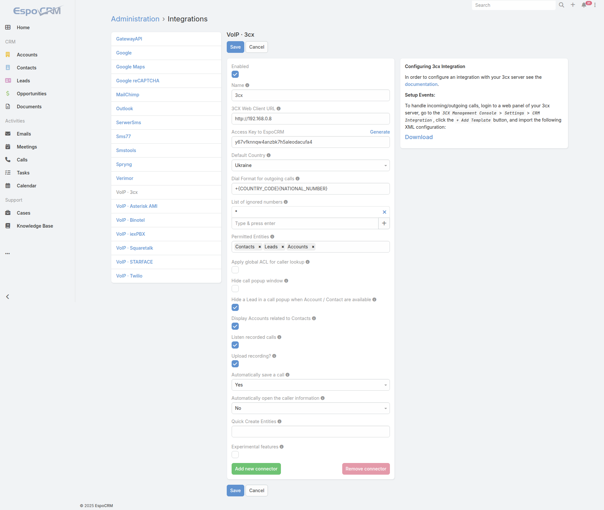
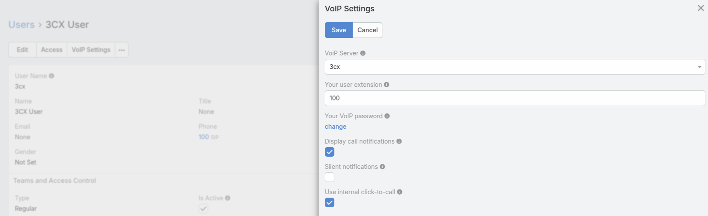

# 3CX Integration Setup

3CX integration is available as part of [VoIP Integration extension](https://www.espocrm.com/extensions/voip-integration/). It allows to integrate EspoCRM with 3CX server and other VoIP providers, read more details [here](https://www.espocrm.com/features/3cx-integration/).

## How to setup 3CX Integration for an administrator

Fill in the connection details of your 3CX server. To do this, go to the Administration (System panel) > Integrations > VoIP · 3cx.

* **Name** – name of your connection.
* **3CX Web Client URL** – URL of your 3CX web client.
* **Access Key to EspoCRM** – access key to EspoCRM for 3CX server.
* **Default Country** – the country is used to format phone numbers.
* **Dial Format for outgoing calls** – a phone number format for outgoing (click-to-call) calls.
* **List of ignored numbers** – list of numbers which will be ignored. Popup window will not be displayed. Use numbers in the following formats: +14844608117 (full number match) or #4844608117# (regular expression).
* **Permitted Entities** – entities that will be displayed in the popup window and will be used to identify a caller by his phone number.
* **Apply global ACL for caller lookup** – apply global ACL rules (Administration > Roles) for caller lookup. This information is displayed in the popup window. If unchecked, no ACL restrictions are used.
* **Hide call popup window** – automatically process call pop-ups without displaying them.
* **Hide a Lead** – hide a Lead in a call popup when Account / Contact are available.
* **Display Accounts related to Contacts** – display only Accounts related to Contacts.
* **Listen recorded calls** – if you want to have possibility to listen recorded calls. This option should also be enabled in your telephony server.
* **Upload recording?** – enables uploading recordings into EspoCRM.
* **Automatically save a call** – automatically save incoming/outgoing calls in the system without having to press "Save" button.
* **Automatically open the caller information** – automatically open the caller information for incoming/outgoing calls.
* **Quick Create Entities** – entities which can be created through the call popup window.

## How to setup 3CX Integration events

To handle incoming/outgoing calls, download the XML configuration from the side panel in the Administration (System panel) -> VoIP · 3cx, go to the 3CX Management Console -> “Settings” -> “CRM Integration”, click the “+ Add Template” button, and import the downloaded XML configuration.

## How to setup 3CX Integration for users

Each user who wants to use 3CX integration, should setup his access in the User’s Profile, under “VoIP Settings”. Also, the user can change some VoIP settings on this window.

* **VoIP Server** – your current VoIP server.
* **Your user extension** – your internal user extension (SIP user) of the 3CX server.
* **Your VoIP password** – your password of the 3CX server.
* **Display call notifications** – an option to enable/disable incoming/outgoing call notifications.
* **Silent notifications** – mute notification sound.
* **Use internal click-to-call** – an option to enable/disable the internal click-to-call feature. It is a feature to make outgoing calls through the 3CX server. If the checkbox is unchecked, then an external application will handle “tel:” links.
* **User Dial Context** – Dial Context for a User. If it is empty, a Dial Context of a connector will be used.

## Access control for users

Make sure that your users have the access to the entity 'Calls'.

* [Grant access to Calls](customization.md#grant-access-to-calls)

## Summary and Transcript fields

To access Summary and Transcript fields, you need to drag these fields to the Call layout in EspoCRM. Go to Administration > Layout Manager > Calls and drag the corresponding fields to the layout you need.

## Update 3CX Configuration File

Following the upgrade of the VoIP Integration extension, it is necessary to update the XML Template on the 3CX Server side in order to ensure proper integration.

The steps to update are as follows:

1\. In the EspoCRM instance, go to the Administration > Integrations > VoIP · 3cx and download the latest version of the 3CX XML template.

2\. Navigate to the 3CX Management Console > Settings > CRM Integration, and delete the existing template.

3\. Click on the `+ Add Template` button and upload the newly downloaded XML template.

4\. Save the changes.
