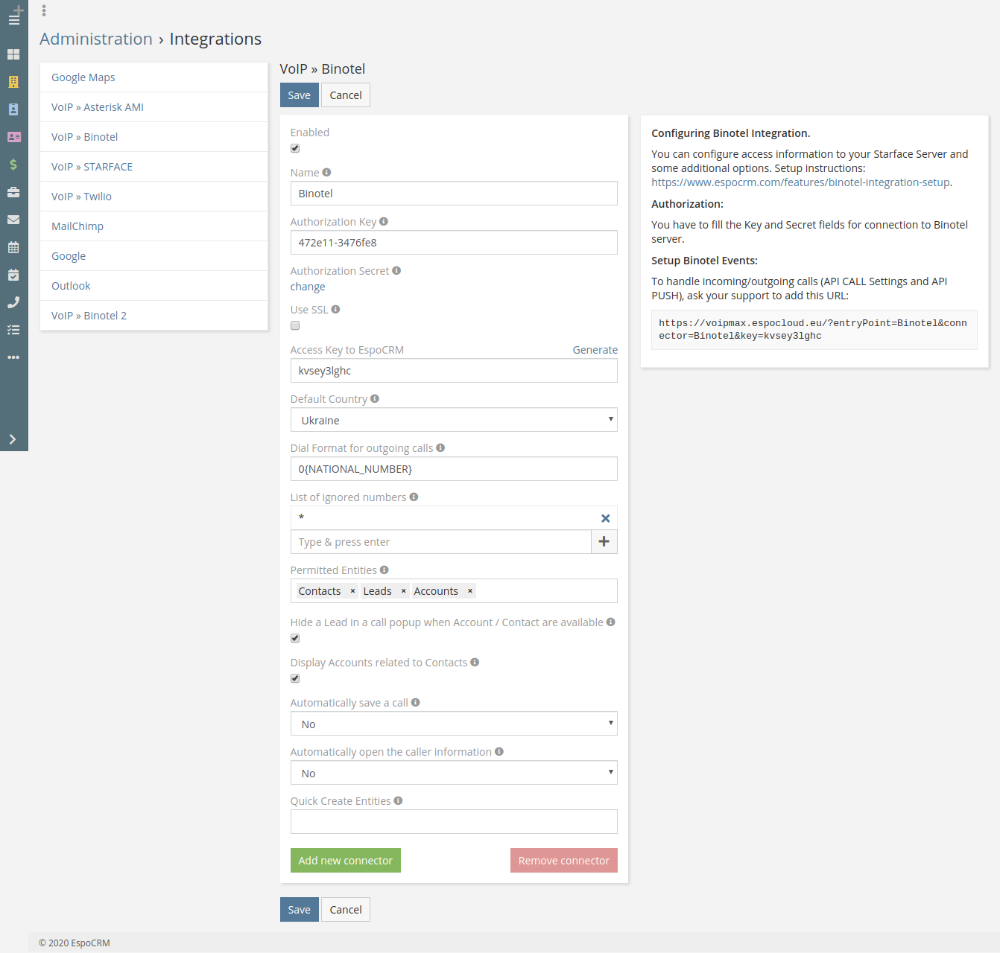
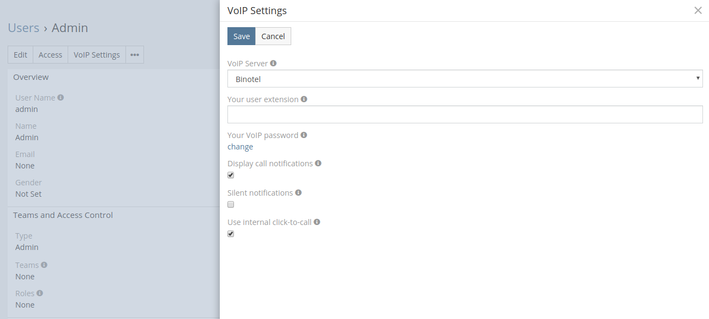

# Binotel Integration Setup

Binotel Integration is available as part of [VoIP Integration extension](https://www.espocrm.com/extensions/voip-integration/). It allows to integrate EspoCRM with Asterisk server through Asterisk Manager Interface (AMI), Starface and Binotel server, read more details [here](https://www.espocrm.com/features/binotel-integration/).

## How to setup Binotel Integration for an administrator

1\. Fill in the connection details of your Binotel server. For this go to the Administration (System panel) -> VoIP » Binotel.

* **Name** – name of your Binotel connector.
* **Authorization Key** – authorization Key to the Binotel server.
* **Authorization Secret** – authorization Secret to the Binotel server.
* **Use SSL** – Use SSL for connection to the server Binotel.
* **Access Key** – the key to access to EspoCRM to handle incoming/outgoing calls.
* **Default Country** – The country is used to format phone numbers. E.g. 02011112222 for United Kingdom will be formatted to +442011112222.
* **Dial Format for outgoing calls** – Phone number format for outgoing (click-to-call) calls.
E.g. for "+44 (203) 111-22-33": {COUNTRY_CODE} - "44", {NATIONAL_NUMBER} - "2031112233".
* **List of ignored numbers** – list of numbers, which will be ignored and popup window will not be displayed. Use numbers in the following formats: +14844608117 (full number match) or #4844608117# (regular expression).
* **Permitted Entities** – entities that will be displayed in popup window and will be used to identify a caller by his phone number.
* **Hide a Lead** – Hide a Lead in a call popup when Account / Contact are available.
* **Display Accounts related to Contacts** – display an account related to the contact in the popup window.
* **Automatically open the caller information** – automatically open the caller information for incoming/outgoing calls.
* **Quick Create Entities** – entities which can be created through a call popup.

2\. Contact Binotel support to add an URL (see “Post URL” field) to handle incoming/outgoing calls (API CALL Settings and API PUSH):
**http://espocrm.local/?entryPoint=Binotel&connector=Binotel&key=hh9v0zr529**

## How to setup Binotel Integration for users

Each user who uses telephony should setup his user extension in User’s Profile, button “VoIP Settings”. Also, the user can disable a popup window for incoming/outgoing calls.

* **VoIP Server** – VoIP server selection.
* **Your user extension** – your Binotel user extension (e.g. “299”, “1001”).
* **Your VoIP password** – your password to access to Binotel.
* **Display call notifications** – if you want to receive incoming/outgoing call notifications.
* **Silent notifications** – mute notification sound.
* **Use internal click-to-call** – switching internal click-to-call possibility. Internal click-to-call is a feature to originate an outgoing call. If the checkbox is unchecked, then will be used an external application to handle tel: links.

## Access control for users

Make sure that your users have the access to the entity 'Calls'. 

* [Grant access to Calls](customization.md#grant-access-to-calls)
