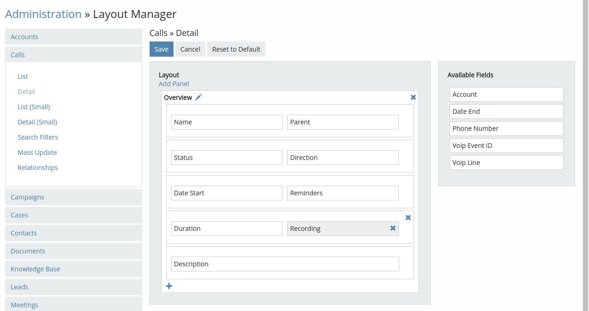
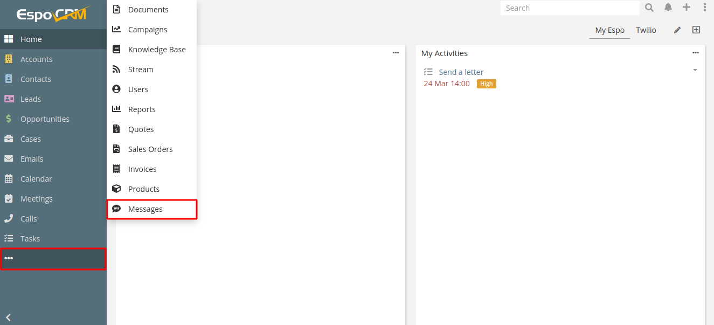

# VoIP Customization

In this article:

* [Displaying a call recording](#displaying-a-call-recording)
* [Grant access to Messages](#grant-access-to-messages)
* [Grant access to Calls](#grant-access-to-calls)
* [Add click-to-call feature to a custom entity](#add-click-to-call-feature-to-a-custom-entity)
* [Add custom entities to Permitted Entities](#add-custom-entities-to-permitted-entities)
* [Add custom entities to Quick Create Entities](#add-custom-entities-to-quick-create-entities)
* [Event information in Permitted / Quick Create Entity](#event-information-in-permitted-quick-create-entity)
* [Adding a call name to a call popup](#adding-a-call-name-to-a-call-popup)
* [Format phone number](#format-phone-number)
* [Call recording for Asterisk](#call-recording-for-asterisk)
* [Adding a custom call recording URL handler](#custom-call-recording-url-handler)
* [Adding a custom ApiClient](#custom-apiclient)
* [Adding a custom EventListener](#custom-eventlistener)
* [Adding a custom WebhookHandler](#custom-webhookhandler)
* [Adding a custom CidManager](#custom-cidmanager)
* [Additional info](#additional-info)


##  Displaying a call recording

For displaying call recordings in EspoCRM, go to Administration > Layout Manager > select Calls entity and add the field "Recording" for Detail layout. See the screenshot:



After that, clear a local cache (Menu > Clear Local Cache).


## Grant access to Messages

By default regular users don’t have access to Message entity. Administrator needs to grant access to this entity:

1. Login as Administrator in EspoCRM.
2. Navigate to the Administration > Roles.
3. Create / edit a Twilio role.
4. Grant access to the Message entity.


By default the Message entity tab should be added into the tab list.



## Grant access to Calls

Don't forget to give users access to the entity '**Calls**', so that they could make and accept calls. Go to the needed **User** > **Roles**.

Select the role or create a new one. Turn on '**Enabled**' access to the entity '**Calls**' and click '**Save**'.

## Add click-to-call feature to a custom entity

To add a click-to-call feature to a custom entity you have to create/edit a file `/custom/Espo/Custom/Resources/metadata/entityDefs/<YOUR_ENTITY>.json`.

In this file should be defined a phoneNumber field (a field with "type": "phone"). Add the following line to this field:

```
{
    "fields": {
        "phoneNumber": {
            ......,
            "view": "voip:views/fields/phone"
        }
    }
}
```

Make sure that your JSON data is correct after changes.

To take effect, clear a system cache (Administration > Clear Cache) and reload a page in your browser.


## Add custom entities to Permitted Entities

**Important**: the added entity must be of the `Person` type.

To add some custom entities to Permitted Entities, create/modify the file `/custom/Espo/Custom/Resources/metadata/integrations/<CONNECTOR_NAME>.json` with the code:

(e.g. for Asterisk connector it's the file `/custom/Espo/Custom/Resources/metadata/integrations/Asterisk.json`)

```
{
    "fields": {
        "permittedEntities": {
            "options": [
                "__APPEND__",
                "<YOUR_CUSTOM_ENTITY>"
            ]
        }
    }
}
```

Make sure that your JSON data is correct after changes.
To take effect, clear a system cache (Administration > Clear Cache) and reload a page in your browser.

## Add custom entities to Quick Create Entities

To add some custom entities to Quick Create Entities, create/modify the file `/custom/Espo/Custom/Resources/metadata/integrations/<CONNECTOR_NAME>.json` with the code:

(e.g. for Asterisk connector it's the file `/custom/Espo/Custom/Resources/metadata/integrations/Asterisk.json`)

```
{
    "fields": {
        "quickCreateEntities": {
            "options": [
                "__APPEND__",
                "<YOUR_CUSTOM_ENTITY>"
            ]
        }
    }
}
```

Make sure that your JSON data is correct after changes.
To take effect, clear a system cache (Administration > Clear Cache) and reload a page in your browser.

## Event information in Permitted / Quick Create Entity

There is a way to get event information while creating a `Permitted` / `Quick Create` entity.

For example, if we need to fetch a `phoneNumber` into the `description` field for a **Task** entity:

1. Add the field in `custom/Espo/Custom/Resources/metadata/entityDefs/Task.json`:

```
{
    "fields": {
        "voipEventData": {
            "type": "jsonObject",
            "notStorable": true
        }
    }
}
```

2. Make rebuild and grant the [necessary permissions](https://docs.espocrm.com/administration/server-configuration/#permissions).

3. Add the following formula in `Administration` > `Entity Manager` > `Task` > `Formula` > `Before Save Custom Script`:

```
$voipEventData = json\encode(voipEventData);
description = json\retrieve($voipEventData, 'phoneNumber');
```

In addition to `phoneNumber`, additional data such as `id`, `status`, `type`, `assignedUserId`, etc., can be fetched from `voipEventData`. All data can be viewed after adding the `voipEventData` field to a layout.

## Adding a call name to a call popup

To display a Call name field in a call popup, create/modify the file `custom/Espo/Custom/Resources/metadata/app/popupNotifications.json` with the code:

```
{
    "voipNotification": {
        "additionalFields": {
            "callName" : {
                "display": true,
                "fullWidth": true,
                "entity": "Call",
                "field": "name",
                "order": 9
            }
       }
    }
}
```

* default order is 10.

Make sure that your JSON data is correct after changes.
To take effect, clear a system cache (Administration > Clear Cache) and reload a page in your browser.

## Format phone number

When a telephony server returns a phone number in a wrong format e.g. `004959123456789@SIP-PROVIDER-154303332258115083be1`. To get this number in a normal format, create/edit a file `custom/Espo/Custom/Resources/metadata/app/voip.json` and add the code:

```
{
    "phoneNumberReplacement": {
        "Asterisk": {
            "^goip-.*?\\/": "",
            "@SIP-PROVIDER.*": ""
        }
    }
}
```

where

* "Asterisk" - a connector ID;
* "@SIP-PROVIDER.\*" - regular expression to find unnecessary characters;
* "" - a string for replacing.

Note: JSON format has its own quoting, e.g. a symbol "/" should be quoted like "\\/".

Then go to Administrator panel > Clear cache.


## Call recording for Asterisk

The call recording should be configured on the Asterisk side, the URL of that recording will be saved in EspoCRM.

The setup process:

1\. Configure a call recording on the Asterisk side.

2\. Login to EspoCRM under the administrator and go to the Asterisk connector (Administration > VoIP Settings > Asterisk AMI).

3\. Enable the "Listen recorded calls" option and configure the "URL to recorded calls" field.

Possible parameters:

* "{VOIP_UNIQUEID}" - uniqueid of a call;
* "{Y}" - year of a call;
* "{m}" - month of a call;
* "{d}" - day of a call.

Example:
If we have a link in a format: "http://11.11.11.11/2019/11/25/1568202771.6.mp3", then the "URL to recorded calls" should be the following:
`http://11.11.11.11/{Y}/{m}/{d}/{VOIP_UNIQUEID}.mp3`

4\. Display a call recording field in a layout of Call entity.

For displaying a call recording field in EspoCRM, go to Administration > Layout Manager > select Calls entity and add the field "Recording" for Detail layout. See the screenshot:


After that, clear a local cache (Administration > Clear Cache).

## Custom call recording URL handler

If the standard functionality is not enough for your URL recording, there is a possibility to create a custom call recording URL handler. For this, create a file located at `custom/Espo/Custom/Modules/Voip/Providers/Asterisk/Scripts/Recording.php` with the code:

```
<?php

namespace Espo\Custom\Modules\Voip\Providers\Asterisk\Scripts;

use Espo\Modules\Voip\Entities\VoipEvent as VoipEventEntity;

class Recording extends \Espo\Modules\Voip\Providers\Asterisk\Scripts\Recording
{
    public function generateUrl(VoipEventEntity $voipEventEntity)
    {
        // YOUR CUSTOM CODE
    }
}
```

After saving, clear a local cache (Administration > Clear Cache).

## Custom ApiClient

For adding a custom `ApiClient`, create a file located at `custom/Espo/Custom/Modules/Voip/Providers/YOUR_PROVIDER/ApiClient.php` with the code:

```
<?php

namespace Espo\Custom\Modules\Voip\Providers\YOUR_PROVIDER;

class ApiClient extends \Espo\Modules\Voip\Providers\YOUR_PROVIDER\ApiClient
{
    // YOUR CUSTOM CODE
}
```

After saving, clear a local cache (Administration > Clear Cache).

## Custom EventListener

For adding a custom `EventListener`, create a file located at `custom/Espo/Custom/Modules/Voip/Providers/YOUR_PROVIDER/EventListener.php` with the code:

```
<?php

namespace Espo\Custom\Modules\Voip\Providers\YOUR_PROVIDER;

class EventListener extends \Espo\Modules\Voip\Providers\YOUR_PROVIDER\EventListener
{
    // YOUR CUSTOM CODE
}
```

After saving, clear a local cache (Administration > Clear Cache).

## Custom WebhookHandler

For adding a custom `WebhookHandler`, create a file located at `custom/Espo/Custom/Modules/Voip/Providers/YOUR_PROVIDER/WebhookHandler.php` with the code:

```
<?php

namespace Espo\Custom\Modules\Voip\Providers\YOUR_PROVIDER;

class WebhookHandler extends \Espo\Modules\Voip\Providers\YOUR_PROVIDER\WebhookHandler
{
    // YOUR CUSTOM CODE
}
```

After saving, clear a local cache (Administration > Clear Cache).


## Custom CidManager

For adding a custom `CidManager`, create a file located at `custom/Espo/Custom/Modules/Voip/Providers/YOUR_PROVIDER/CidManager.php` with the code:

```
<?php

namespace Espo\Custom\Modules\Voip\Providers\YOUR_PROVIDER;

class CidManager extends \Espo\Modules\Voip\Providers\YOUR_PROVIDER\CidManager
{
    // YOUR CUSTOM CODE
}
```

After saving, clear a local cache (Administration > Clear Cache).


## Additional info

**Dialout Channel** – channel format for outgoing calls.

It can be “SIP/###” or “PJSIP/###”, where ### is a user’s extension (internal number). The extension “###” will be substituted automatically depending on the user.
