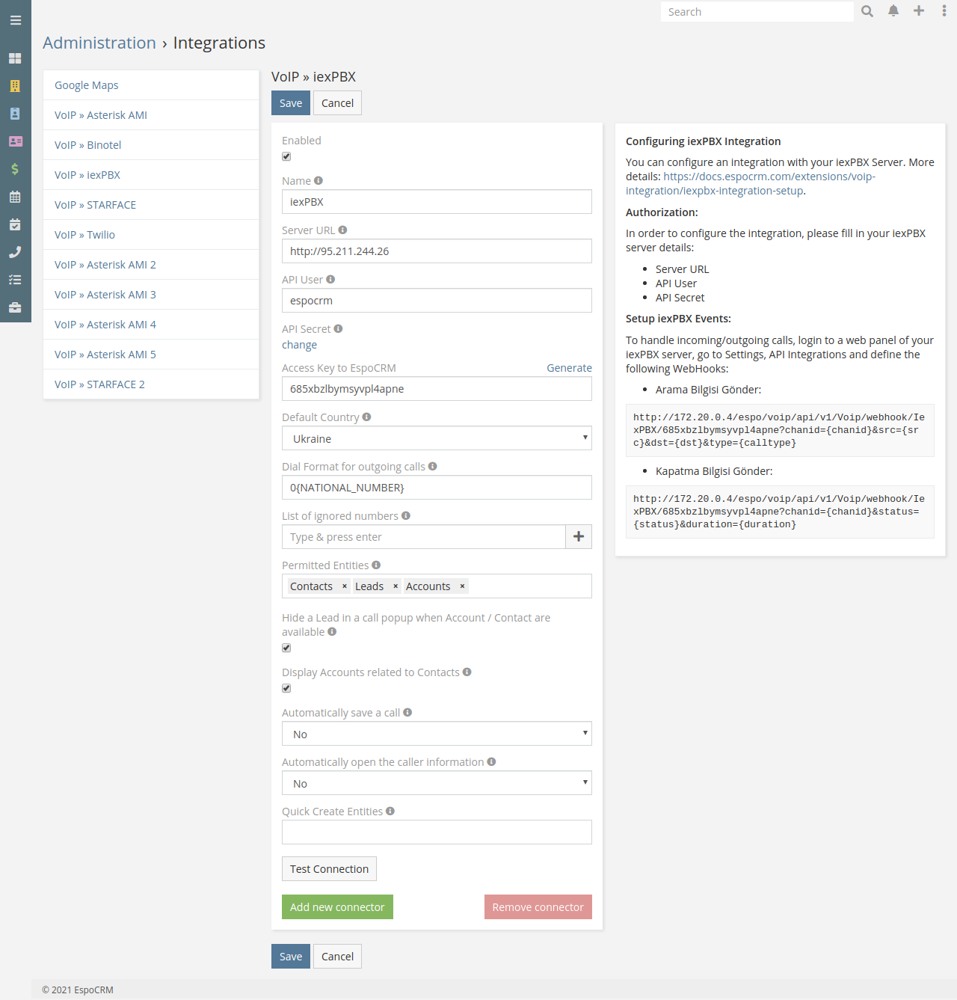
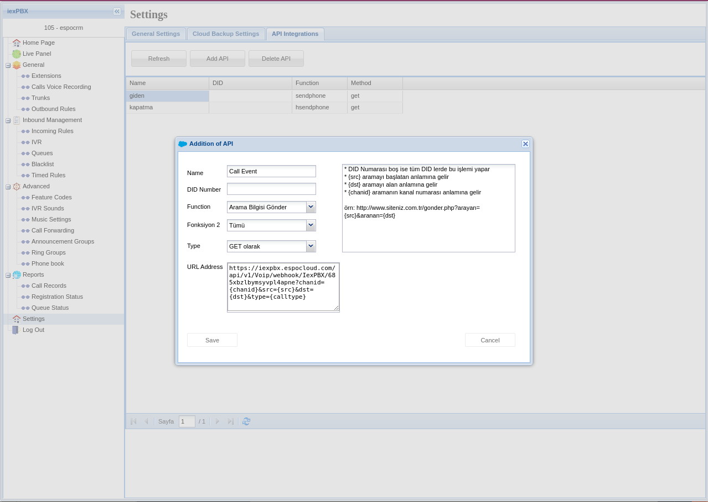
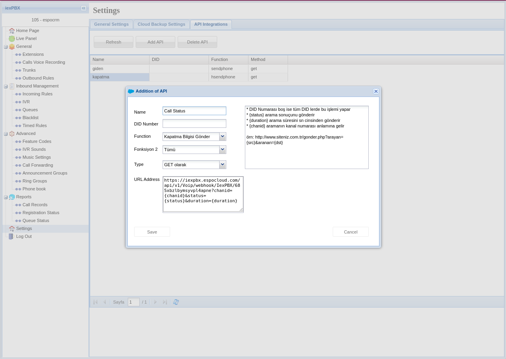
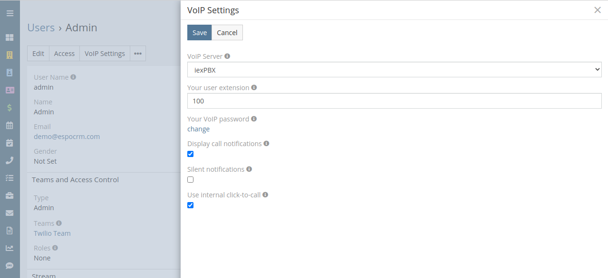

# iexPBX Integration Setup

VoIP Integration extension allows EspoCRM to integrate with an Asterisk server through Asterisk Manager Interface (AMI), Twilio service, Starface server and iexPBX server. For more details about the features, click [here](https://www.espocrm.com/features/voip-integration/).

## How to setup iexPBX Integration for an administrator

#### Step 1:

Fill in the connection details of your iexPBX server. To do this, go to the Administration (System panel) -> VoIP » iexPBX.

* **Name** – name of your connection.
* **Server URL** – URL of your iexPBX server.
* **API User** – API user of your iexPBX server.
* **API Secret** – API Secret of your iexPBX server.
* **Access Key to EspoCRM** – the key to access to EspoCRM to handle incoming/outgoing calls.
* **Default Country** – the country is used to format phone numbers.
* **Dial Format for outgoing calls** – a phone number format for outgoing (click-to-call) calls.
* **List of ignored numbers** – list of numbers which will be ignored. Popup window will not be displayed. Use numbers in the following formats: +14844608117 (full number match) or #4844608117# (regular expression).
* **Permitted Entities** – entities that will be displayed in the popup window and will be used to identify a caller by his phone number.
* **Hide a Lead** – Hide a Lead in a call popup when Account / Contact are available.
* **Display Accounts related to Contacts** – display only Accounts related to Contacts.
* **Automatically save a call** – Automatically save incoming/outgoing calls in the system without having to press "Save" button.
* **Automatically open the caller information** – automatically open the caller information for incoming/outgoing calls.
* **Quick Create Entities** – entities which can be created through the call popup window.

#### Step 2:

Setup webhooks on iexPBX server to handle incoming/outgoing calls. It can be done by login to a web panel of your iexPBX server, go to Settings > API Integrations and define two Webhooks:

##### Call Event Webhook

- Function: `Arama Bilgisi Gönder`
- Fonksiyon 2: `Tümü`
- Type: `GET olarak`
- URL Address: `https://YOUR_ESPOCRM_URL/api/v1/Voip/webhook/IexPBX/YOUR_ACCESS_KEY?chanid={chanid}&src={src}&dst={dst}&type={calltype}`

##### Call Status Webhook

- Function: `Kapatma Bilgisi Gönder`
- Fonksiyon 2: `Tümü`
- Type: `GET olarak`
- URL Address: `https://YOUR_ESPOCRM_URL/api/v1/Voip/webhook/IexPBX/YOUR_ACCESS_KEY?chanid={chanid}&status={status}&duration={duration}`

## How to setup iexPBX Integration for users

Each user who wants to use iexPBX integration, should setup his access in the User’s Profile, under “VoIP Settings”.

* **VoIP Server** – select your iexPBX server.
* **Your user extension** – your internal SIP extension for the iexPBX server (e.g. 101).
* **Your VoIP password** – your SIP password for your iexPBX server.
* **Display call notifications** – an option to enable/disable incoming/outgoing call notifications.
* **Silent notifications** – mute notification sound.
* **Use internal click-to-call** – an option to enable/disable the internal click-to-call feature. It is a feature to make outgoing calls through the iexPBX server. If the checkbox is unchecked, then an external application will handle “tel:” links.
