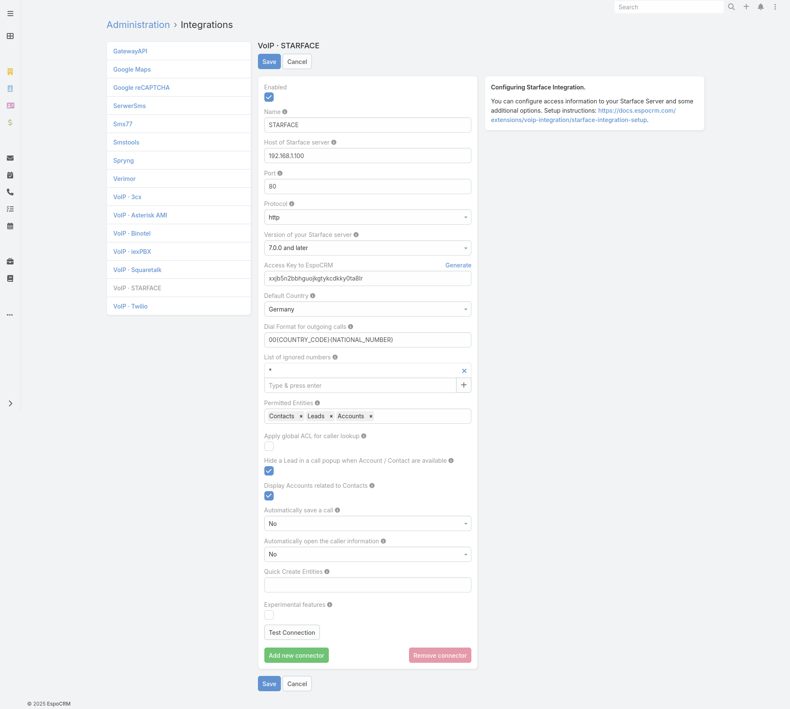
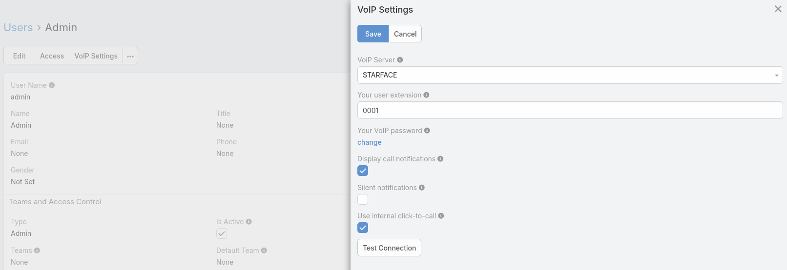

# Starface Integration Setup

Starface integration is available as part of [VoIP Integration extension](https://www.espocrm.com/extensions/voip-integration/). It allows to integrate EspoCRM with Starface server and other VoIP providers, read more details [here](https://www.espocrm.com/features/starface-integration-setup/).

## Supported Starface servers

VoIP Integration extension supports* the following Starface servers:

* Starface 9.0
* Starface 8.1
* Starface 8.0
* Starface 7.3
* Starface 7.2
* Starface 7.1
* Starface 7.0
* Starface 6.7
* Starface 6.6
* Starface 6.5
* Starface 6.4
* Starface 6.3
* Starface 6.2

\* These servers were tested with the VoIP Integration extension.

## How to setup Starface Integration for an administrator

Fill in the connection details of your Starface server. To do this, go to the Administration (System panel) -> VoIP » STARFACE.

* **Name** – name of your connection.
* **Host** – IP or domain name of your Starface Server.
* **Port** – port for connection by AMI interface.
* **Protocol** – protocol that is used for connection of Starface server (HTTP, HTTPS).
* **Version of your Starface server** – version of your Starface server. This is an important option since Starface 6.4.2 is used a new authorization protocol.
* **Default Country** – the country is used to format phone numbers.
* **Dial Format for outgoing calls** – a phone number format for outgoing (click-to-call) calls.
* **List of ignored numbers** – list of numbers which will be ignored. Popup window will not be displayed. Use numbers in the following formats: +14844608117 (full number match) or #4844608117# (regular expression).
* **Permitted Entities** – entities that will be displayed in the popup window and will be used to identify a caller by his phone number.
* **Hide a Lead** – Hide a Lead in a call popup when Account / Contact are available.
* **Display Accounts related to Contacts** – display only Accounts related to Contacts.
* **Automatically save a call** – Automatically save incoming/outgoing calls in the system without having to press "Save" button.
* **Automatically open the caller information** – automatically open the caller information for incoming/outgoing calls.
* **Quick Create Entities** – entities which can be created through the call popup window.

## How to setup Starface Integration for users

Each user who wants to use Starface integration, should setup his access in the User’s Profile, under “VoIP Settings”. Note that login and password should be to the Starface web interface, not to the SIP credentials. Also, the user can change some VoIP settings on this window.

* **VoIP Server** – your current VoIP server.
* **Your user extension** – your login ID for the Starface web interface.
* **Your VoIP password** – your password for the Starface web interface.
* **Display call notifications** – an option to enable/disable incoming/outgoing call notifications.
* **Silent notifications** – mute notification sound.
* **Use internal click-to-call** – an option to enable/disable the internal click-to-call feature. It is a feature to make outgoing calls through the Starface server. If the checkbox is unchecked, then an external application will handle “tel:” links.

## Access control for users

Make sure that your users have the access to the entity 'Calls'.

* [Grant access to Calls](customization.md#grant-access-to-calls)

