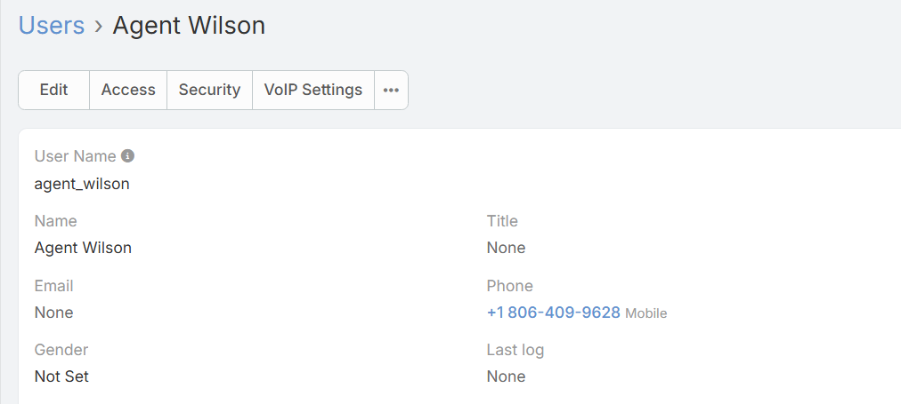

# Detailed Twilio Call forwarding configuration guide 
<!-- title text differs from the file one -->
1. Create Twilio Account: https://www.twilio.com/try-twilio

 <!-- paths need to be chanched -->

2. In the list on the left, go to United States (US1) (or any other country) > Phone Numbers > Manage > Active Numbers and buy a number by pressing the *Buy a number* button in the upper-right corner.

 

3. Go to your instance of EspoCRM, click the three dots in the top-right corner and select your User. Paste your real phone number into Phone field.

4. In your EspoCRM instance, go to Administration > Integrations > VoIP » Twilio and configure everything as follows: [How to configure Twilio Integration for an administrator](twilio-integration-setup.md#how-to-configure-twilio-integration-for-an-administrator)

5. Click *Test Connection* button and save the Connector.

6. In the EspoCRM instance configure VoIP Router as indicated in the following instructions: [How to configure routing of Twilio phone numbers](twilio-integration-setup.md#how-to-configure-routing-of-twilio-phone-numbers)

## How to test the connection
To test the connection, you need two real phone numbers: one that you've just entered in the User phone number field and another that you will call.
1. Create a Contact record. Paste your second real phone number into the phone number field.
2. Make a call from your EspoCRM instance by clicking the Contact's phone number. Accept the call on first phone number and wait for the call to reach the second number. 
Two separate numbers should be used to test the connection properly.

!!! note
        
    If the call drops, check Twilio's *Voice Geographic Permissions*: https://console.twilio.com/us1/develop/voice/settings/geo-permissions. Mark your country with a checkbox and click on the *Save* button.
