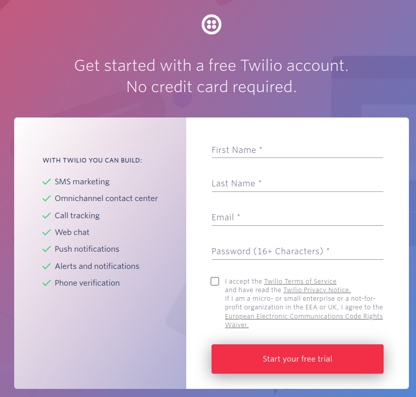
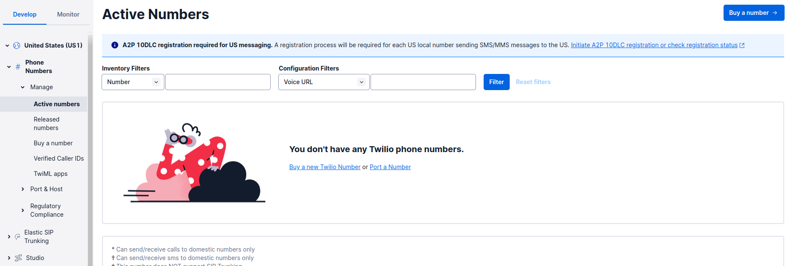
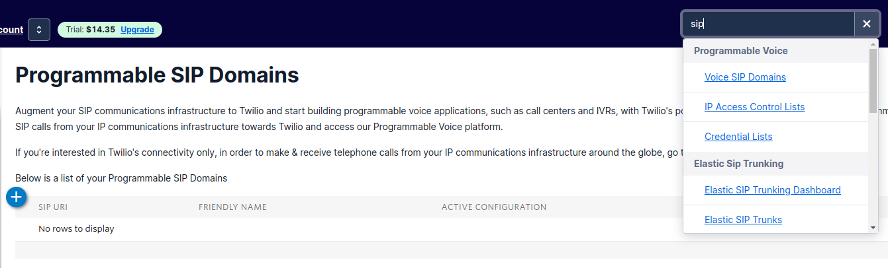
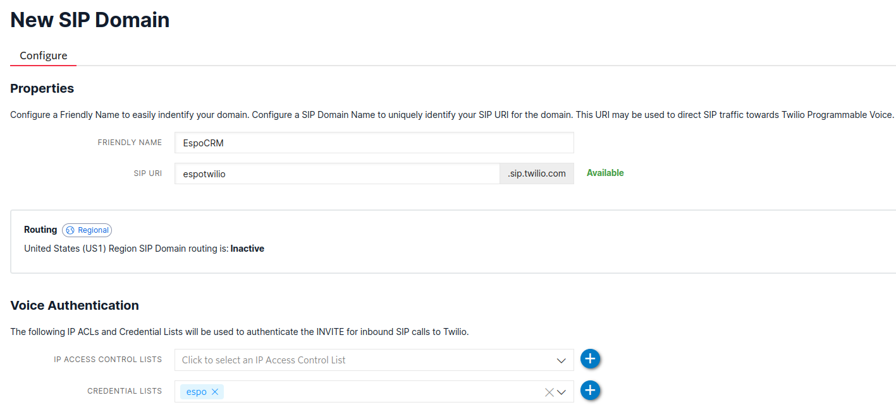
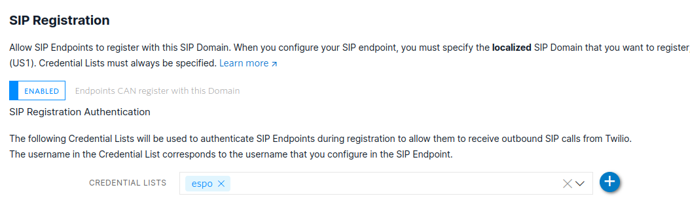
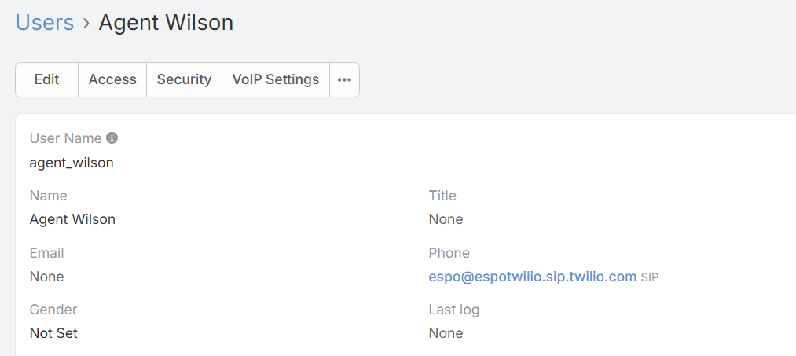

# Detailed Twilio SIP Trunk configuration guide 
<!-- title text differs from the file one -->
1. Create Twilio Account: https://www.twilio.com/try-twilio

 <!-- paths need to be chanched -->

2. In the list on the left, go to United States (US1) (or any other country) > Phone Numbers > Manage > Active Numbers and buy a number by pressing the *Buy a number* button in the upper-right corner.

 

3. Search for the word `sip` and go to *Voice SIP Domains*, then press the **plus** button to create SIP Domain.

 

4. Enter a Friendly Name for your SIP Domain, its SIP URL, then create a Credential List by pressing **plus** button in *Voice Authentication* section. In the *SIP Registration* section, click the Disable slider to enable it, and select the Credential List you created. SIP URL and SIP Credentials usernames will be used in the following points to connect the user to the SIP client and more.

5. Go to your instance of EspoCRM, click the three dots in the top-right corner and select your User. Paste the following value into Phone field in the following format: `credential_username@SIP_URL.sip.twilio.com`. It should look something like this (it is important that the Phone type is SIP, as in the screenshot):

6. In your EspoCRM instance, go to Administration > Integrations > VoIP » Twilio and configure everything as follows: [How to configure Twilio Integration for an administrator](twilio-integration-setup.md#how-to-configure-twilio-integration-for-an-administrator)

7. Additionally, set the *Enabled SIP Domain* value. If the previous steps were completed correctly, available options will be displayed as a drop-down menu.

8. Click *Test Connection* button and save the Connector.

9. In the EspoCRM instance configure VoIP Router as indicated in the following instructions: [How to configure routing of Twilio phone numbers](twilio-integration-setup.md#how-to-configure-routing-of-twilio-phone-numbers)

## How to test the connection

1. Log in to any convenient SIP client (for example, Zoiper, Linphone, Jami or any other) using the credentials created earlier, where the username will be in the `credential_username@SIP_URL.sip.twilio.com` format, the password is the one you specified for this credential.
2. Make a call from your EspoCRM instance by clicking on the phone number, accept the call in the SIP client and wait for the call to reach the desired number. Two separate numbers should be used to test the connection properly

!!! note
        
    If the call drops, check Twilio's *Voice Geographic Permissions*: https://console.twilio.com/us1/develop/voice/settings/geo-permissions. Mark your country with a checkbox and click on the *Save* button.
