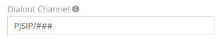
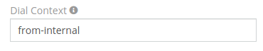
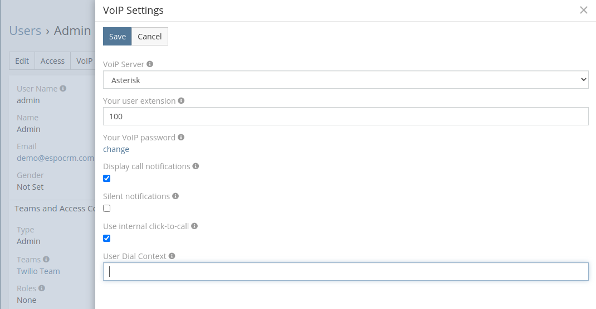
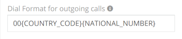
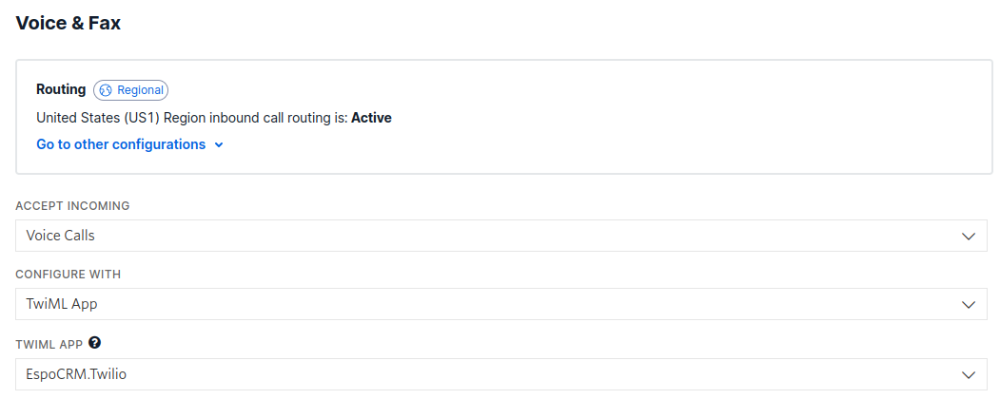
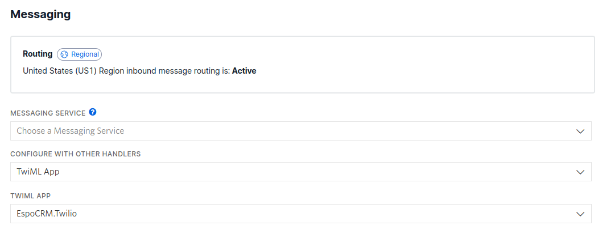

# VoIP Troubleshooting

In this article:

* [How to report](#how-to-report)
* [VoIP error debug](#voip-error-debug)
* [Asterisk: The popup window is not displayed](#asterisk-the-popup-window-is-not-displayed)
* [Asterisk: Click to call is not working](#asterisk-click-to-call-is-not-working)
* [Starface: The popup window is not displayed](#starface-the-popup-window-is-not-displayed)
* [Twilio: Unable to activate the phone number](#twilio-unable-to-activate-the-phone-number)

## How to report

1. Provide an EspoCRM log file with the [debug error information](#voip-error-debug).
2. Provide an error description from the VoIP server side (if you have an access to a debugger or logger).
3. Provide steps to reproduce the error.
4. Provide screenshots with:
  1. Administration > Integrations > VoIP integration configs;
  2. Administration > VoIP Routing > Your VoIP number;
  3. Defined phone numbers in the user profile (if a user can't make or receive a call).
5. Describe details of this call:
  1. Time of the call;
  2. Caller phone number;
  3. Called phone number.

## VoIP error debug

1. Enable debug mode as described [here](../../administration/troubleshooting.md/#debug-mode).
2. Reproduce an error again.
3. Get an EspoCRM [log file](../../administration/troubleshooting.md/#check-logs) and send it to the support team.

## Asterisk: The popup window is not displayed

To be able to make / receive calls with the popup window, check these items:

1. If Asterisk server is properly [configured](asterisk-integration-setup.md#step-1).
2. If cron job is [configured](asterisk-integration-setup.md#step-2).
3. If internal users are [configured](asterisk-integration-setup.md#how-to-setup-asterisk-integration-for-users). In some cases, Asterisk server doesn't provide internal number, but you can add other user numbers in his [profile](asterisk-integration-setup.md#additional-phone-numbers-for-users).
4. If your SIP client are running.

Now, you can make calls from SIP client or from EspoCRM.

## Asterisk: Click to call is not working

VoIP Integration extension is sending a request to Asterisk server when you click on a phone number.
Make sure the following parameters are correct (Administration > VoIP Settings > VoIP » Asterisk AMI):
1. `Dialout Channel` - it determines the channel for outgoing calls. It can be "PJSIP/###" (Asterisk 13+) or "SIP/###", where ### is a user’s extension (internal number). The extension "###" will be substituted automatically depending on the user.

  

2. `Dial Context` - context of your outgoing calls. The default value of Asterisk server is `from-internal`. If you use some custom extension in your Asterisk server, you have to define it in EspoCRM.

  

3. `User Dial Context` - each user can define his own Dial Context in his user's profile. Make sure this option is empty or defined correctly.

  

4. `Dial Format for outgoing calls` - this option may need to be changed depending on the Asterisk server configuration.

## Starface: The popup window is not displayed

Check the following items to find the cause of the issue:

1. If Starface integration is properly [configured](starface-integration-setup.md#step-1).
2. If cron job is [configured](starface-integration-setup.md#step-2).
3. If internal users are [configured](starface-integration-setup.md#how-to-setup-starface-integration-for-users).
4. If your SIP client is running.
5. If your EspoCRM server is available for the Starface server. This is required, because Starface server should send notifications about call events to EspoCRM server.
6. If your `Site URL` (Administration > Settings) corresponds to the real one.

## Twilio: Unable to activate the phone number

In your [Twilio Console](https://www.twilio.com/console) on the left panel click on United States (US1) (or any other country) > Phone Numbers > Manage > Active Numbers > the number you purchased and in the *Voice and Fax* and *Messaging* sections, set the following settings:

