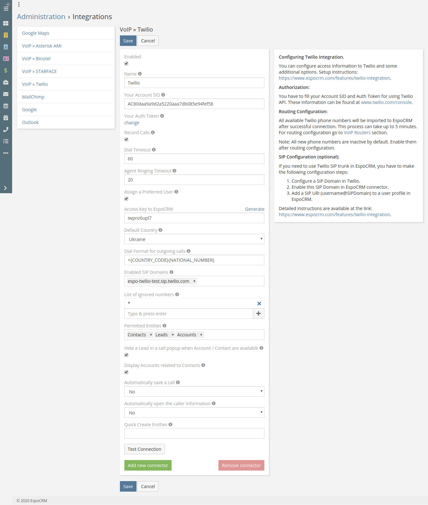
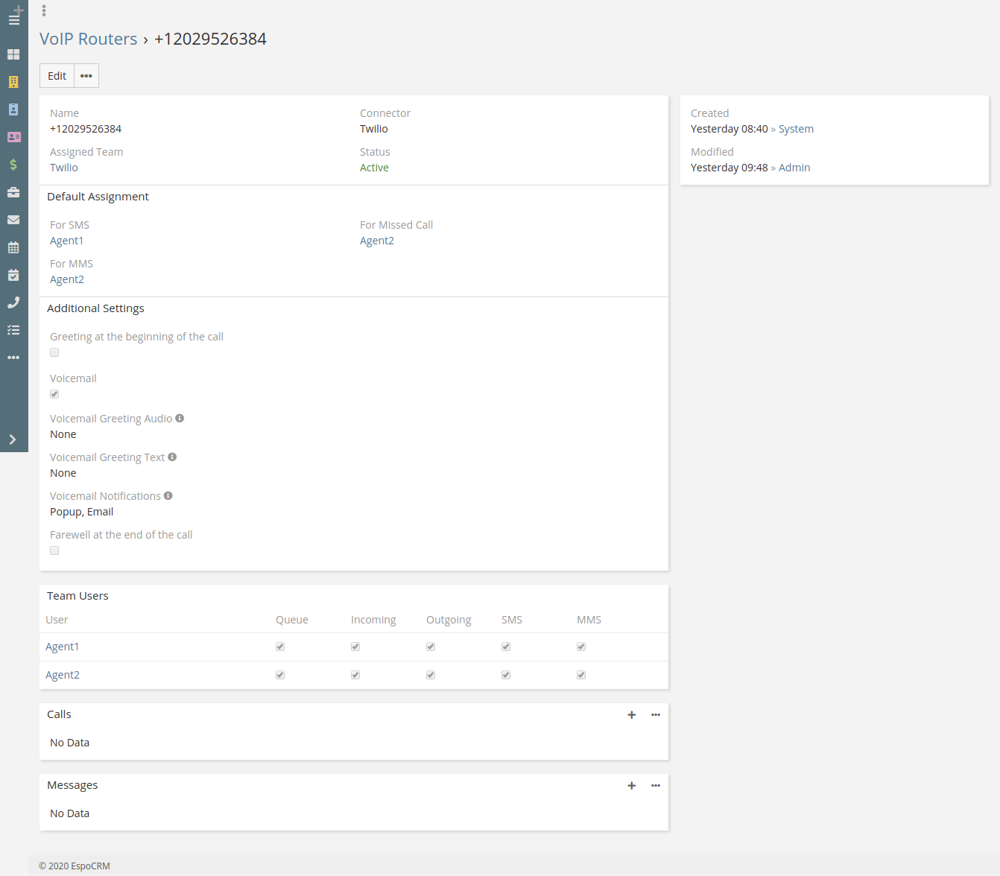
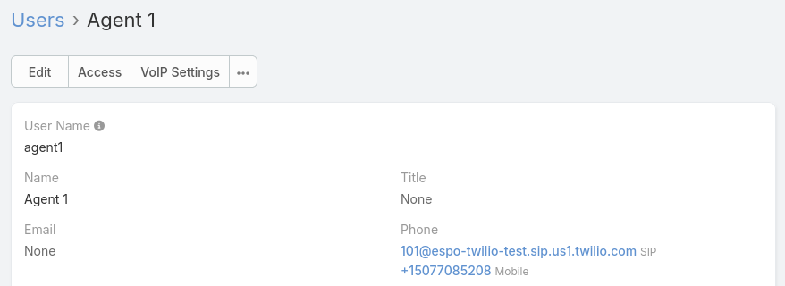
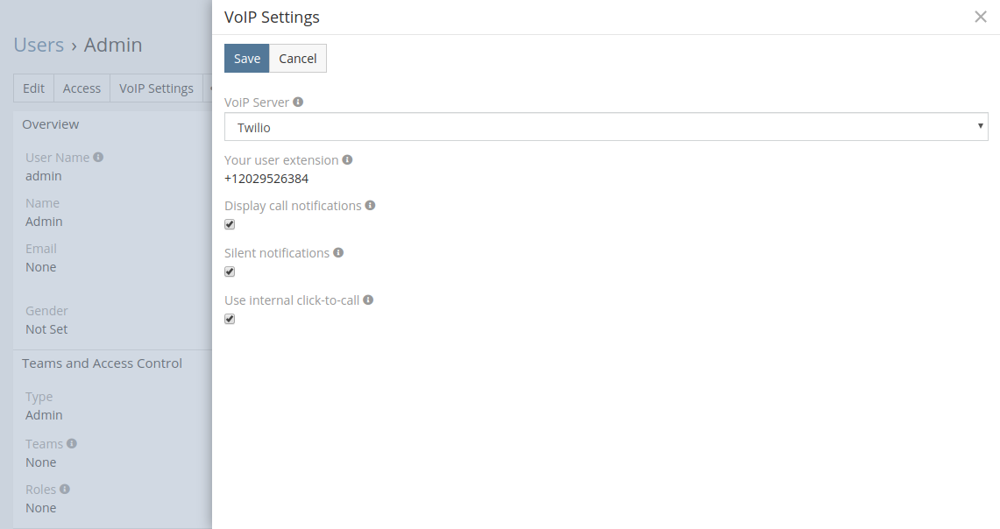
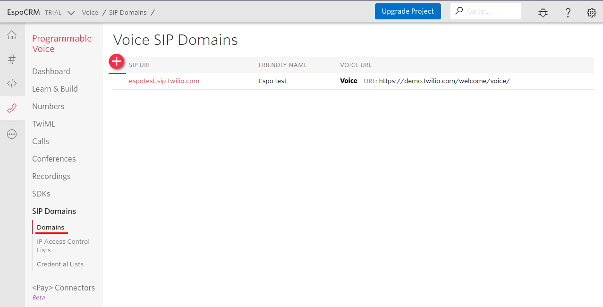
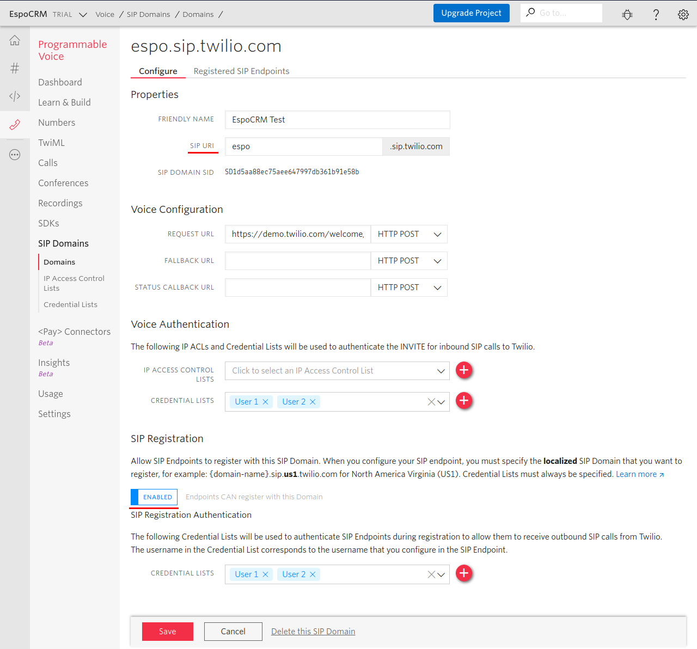
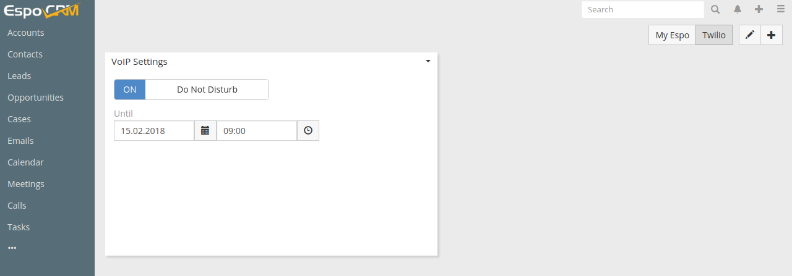

# Twilio Integration Setup

VoIP Integration extension allows EspoCRM to integrate with an Asterisk server through Asterisk Manager Interface (AMI), Twilio service and Starface server. For more details about the features, please click [here](https://www.espocrm.com/features/voip-integration/).

There are two ways in which you can set up Twillio integration:

1. **Call forwarding**. An incoming call from a Twilio number is forwarded to the user’s primary phone number. For outgoing calls EspoCRM creates a connection between the user’s primary phone number and the number called through Twilio service. For more details about how you will be charged for these calls, [click here](https://support.twilio.com/hc/en-us/articles/223132367-How-Much-am-I-Charged-for-Call-Forwarding-with-Twilio).
2. **Twillio SIP Trunk**. A SIP trunk is a virtual version of a phone line, that isn’t physically connected to a phone company and uses intranet and internal communication systems to access the outside phone lines. More detailed information about Twilio SIP Trunking can be found via the [link](https://www.twilio.com/docs/voice/api/sip-interface).

## How to configure Twilio Integration for an administrator

1. Login to your Twilio account. If you have never used Twilio before, then create the account and purchase a phone number if needed.
2. Login as Administrator in EspoCRM.
3. Navigate to the Administration > VoIP Settings > VoIP » Twilio.
4. Tick off Enabled box.
5. Fill in the connection details of your Twilio account.

* **Name** – name of your connection.
* **Your Account SID** – your Twilio account SID. You can get it at https://www.twilio.com/console.
* **Your Auth Token** – your Twilio Auth Token. You can get it at https://www.twilio.com/console.
* **Record Calls** – an option to enable/disable recording of incoming/outgoing calls.
* **Dial Timeout** – the number of seconds that Twilio will allow the phone to ring before assuming there is no answer.
* **Agent Ringing Timeout** – the waiting limit in seconds to answer the call by the agent, e.g. for an incoming call each agent will get a ringing duration of 20 seconds.
* **Assign a Preferred User** – assign a preferred user for incoming calls, sms/mms, e.g. for an incoming call, if the caller is found in EspoCRM, then Twilio will forward the call to the assigned user instead of the routing user list.
* **Access Key to EspoCRM** – an access key of EspoCRM to post data from Twilio.
* **Default Country** – the country is used to format phone numbers.
* **Dial Format for outgoing calls** – a phone number format for outgoing (click-to-call) calls.
* **Enabled SIP Domains** – the list of enabled Twilio SIP domains which are used in EspoCRM.
* **List of ignored numbers** – list of numbers which will be ignored. Popup window will not be displayed. Use numbers in the following formats: +14844608117 (full number match) or #4844608117# (regular expression).
* **Permitted Entities** – entities that will be displayed in the popup window and will be used to identify a caller by his phone number.
* **Hide a Lead** – Hide a Lead in a call popup when Account / Contact are available.
* **Display Accounts related to Contacts** – display only Accounts related to Contacts.
* **Automatically save a call** – automatically save incoming/outgoing calls without having to press “Save” button.
* **Automatically open the caller information** – automatically open the caller information for incoming/outgoing calls.
* **Quick Create Entities** – entities which can be created through the call popup window.

## How to configure routing of Twilio phone numbers

After you have successfully filled in the connection details, EspoCRM will import all active Twilio phone numbers (please wait a few minutes the first time).

1. **Configure Routing**

    To configure Twilio phone number routing, please go to Administration > VoIP Routing and select the phone number.

    

* **Assigned Team** – a list of responsible users for the line.
* **Status** – an option to enable/disable the phone number in EspoCRM (in Twilio it will stay active).
* **For SMS** – default assignment for SMS, only if the sender is not found in EspoCRM.
* **For MMS** – default assignment for MMS, only if the sender is not found in EspoCRM.
* **For Missed Call** – a team member who will receive voicemail messages.
* **Greeting at the beginning of the call**
* **Voicemail**
* **Voicemail Greeting Audio** – .mp3 or .wav voicemail greeting file.
* **Voicemail Greeting Text** – a voicemail greeting message. Note: the “Voicemail Greeting Audio” has higher priority.
* **Voicemail Notifications** – Types of notification for a new voicemail message.
* **Farewell at the end of the call**
* **Display the router's phone number as a caller** – display the office phone number (VoIP Router phone number) as caller. 
* **Team Users** – a list of users to configure receiving incoming/outgoing calls, SMS and MMS.

2. **Grant access for Twilio Team members**

    Go to Administration > Roles, create a Role for a Team of Twilio members (defined above) and grant access to the following entities: Calls, Messages, Accounts, Contacts, Leads.

## How to configure Messages (SMS, MMS)

1. Enable Twilio messaging geographic permissions:
    1. Login to your Twilio account.
    2. Navigate to the Programmable SMS > Settings > Geo Permissions or just click the link: https://www.twilio.com/console/sms/settings/geo-permissions.
    3. Enable needed countries.
2. [Grant access to Messages](customization.md#grant-access-to-messages)

## How to setup Twilio Integration for users

Each user has to add his phone number which will be used to handle incoming calls. It can be added in the User’s Profile.
**Note**: If you are using a Twilio SIP, then instead of the phone number, you have to specify the SIP number in the format: “user1@espo.sip.us1.twilio.com”.

All other configuration settings should be made by your administrator. The user can change some VoIP settings in his User’s Profile, under “VoIP Settings”.

* **VoIP Server** – your current VoIP server.
* **Your user extension** – Twilio phone number configured by the administrator .
* **Display call notifications** – an option to enable/disable incoming/outgoing call notifications.
* **Silent notifications** – mute notification sound.
* **Use internal click-to-call** – an option to enable/disable the internal click-to-call feature. It is a feature to make outgoing calls through Twilio. If the checkbox is unchecked, then an external application will handle “tel:” links.

## Access control for users

Make sure that your users have the access to the entity 'Calls'. 

* [Grant access to Calls](customization.md#grant-access-to-calls)

## How to configure SIP Domains

1. Configure a SIP domain in Twillio:

    1. Login to your Twilio account.
    2. Go to Twilio SIP Domains by clicking in the menu on the left side and select “Programmable Voice” option or just click the link: https://www.twilio.com/console/voice/sip/endpoints.

    

    3. The next thing to do is to create a SIP Domain. To do that, select Domains option in the menu on the left side and press “+” button.

    

    4. In the next window, you have to set up the domain configuration. Set the domain name (Friendly name), create your custom SIP URL, create Credential list for Voice Authentication, enable SIP Registration (by default its disabled), select Credential lists (created for Voice Authentication) and click Save.

    

2. Enable this SIP Domain in EspoCRM connector:

    1. Login as Administrator in EspoCRM.
    2. Navigate to the Administration > VoIP Settings > VoIP » Twilio.
    3. Select your custom SIP URL from the “Enable SIP Domains” field.

    

## More Twilio settings for users

Each user can set “Do Not Disturb” mode for incoming lines. To do it, please go to the home page (click on a logo) and add a “VoIP Settings” dashlet (“+” button).

