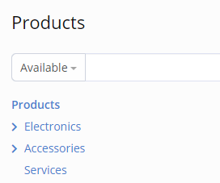

# Products

The Products feature is available in the [Sales Pack](https://www.espocrm.com/extensions/sales-pack/) extension.

Products can be added as line items in Quotes, Sales Orders, Invoices, Credit Notes, Delivery Orders, Receipt Orders, Purchase Orders, and Opportunities.

The *Product* entity type is available for customization in the Entity Manager. You can add custom fields to the Product as well as custom relationships between the Product and other entity types.

A product record has 3 price fields: *Cost*, *List* and *Unit*. The list and unit prices are available only if product-level prices are enabled (in settings). There is the ability to automatically calculate the *Unit Price* using different formulas according to a selected *Pricing Type*. Prices can also be defined in Price Books. Note that it’s possible – and often advisable – to define prices exclusively in Price Books while leaving the list and unit price fields in the product record empty.

Products can be associated with Tax Classes, enabling automated tax application based on defined tax rules. Whenever a product is added to a document, the appropriate tax will be applied to the item.

With the Inventory Management feature enabled, you can track the availability of each product item. The *Is Inventory* field must be checked in the product record to enable inventory tracking.

Products can be printed to PDF. See more detail [here](quotes.md#templates).

The ability to add products as line items of an Opportunity is disabled by default. An administrator needs to add the *Items* panel under Administration > Entity Manager > Opportunity > Layouts > Bottom panels.

In this article:

* [Categories](#categories)
* [Variants](#variants)
* [Properties](#properties)

## Categories

Each product can be linked to a category. Categories can be arranged in a hierarchical tree structure, where each category may include subcategories.

The Product Category is a separate entity type. Access to it is controlled by Roles.

## Variants

*As of Sales Pack v2.0.*

### Product Attributes

Before being able to create products with variants, you need to create some Product Attributes. Product attributes are available under: Products > the top-right menu > Product Attributes.

Every product attribute is supposed to have a specific set of options. Add needed options on the Product Attribute detail view.

Examples of attributes with their options:

* Size – XS, S, M, L, XL
* Color – Red, Blue, White, Black

### Template Products

A Template Product serves as a root for variants. Product variants inherit properties of its template, some properties can be overridden in variants.

To create a product with variants you need to create a template product. Click **Create Product** from the **Products** page, select *Template* **Type**. Then, in the **Template** tab, add needed attributes. For every attribute, select options needed options. Then **Save** the Product.

After that, you need to generate variants. From the template product detail view, open the **Variants** tab in the bottom, click **Generate**. It will generate all possible combinations according to attributes and options of the product template.

You can remove variants that you don't need. E.g. a Red shirt is not produced in the XS size, hence, you need to remove the XS-Red variant.

You can re-generate variants. It will create all missing combinations.

!!! important

    Once a product variant is references somewhere in the system (e.g. in a sales order), you should not remove that variant. Otherwise, after you re-generate it, it will be a different product record with a different ID.

    For the same reason, it's not recommended to add additional attributes to product templates, variants of which are already referenced.

### Miscellaneous

When you select a template product (e.g. in a Quote), a modal dialog will appear prompting to select a specific variant.

Inventory quantity is tracked on the variant level. When viewing the quantity of a Template product, the sum of all variants will be shown.

An Inventory Number cannot be associated with a Product Template. It should be associated with a specific Variant.

It's possible to specify Product fields that should be **synced** between Template and Variants. Administration > Entity Manager > Products > Edit > Variant sync fields. These fields will be read-only in Variants. Whenever the field value is changed in the Template, it will be automatically copied to the Variants. By default, the *Status* field is selected as synced.

## Properties

A product can marked as Sellable, Purchaable, or Subscribable.

### Item Type

*As of v4.0.*

Two options are available: Goods or Services. If Goods is selected, the product can be used in deliveries, receipts, and transfers, and it allows inventory tracking.

### Allow Fractional Quantity

If enabled, it will be possible to use fractional quantity values for a product.

### Track Inventory

Available if the *Inventory Transactions* feature is enabled in the system. If the *Track Inventory* parameter is disabled in a product, its quantity won't be tracked.

Note: In the earlier versions this parameter was called *Is Inventory*.

### Inventory Number Type

Can be empty, Batch or Serial. See more about inventory numbers [here](../extensions/sales-pack/inventory-management.md#inventory-numbers).

### Removal strategy

Available if *Inventory Number Type* is not empty. Determines how Inventory Numbers will be sorted when a user picks a number for a delivery or transfer order.

Available options:

* FIFO – first in, first out; sorted by *Incoming Date* in ascending order;
* FEFO – first expired, first out; sorted by *Expiration Date* in ascending order;
* LIFO – last in, first out; sorted by *Incoming Date* in descending order.

### Expiration Days

Available if *Inventory Number Type* is not empty. A number of days that is automatically added to the current date to determine an *Expiration Date* of an Inventory Number when the number is created in the system. Note that the Expiration Date then can be changed by a user.

### Tax Classes

Tax classes allow the system to automatically select an appropriate Tax Code for a product. For example, a product can have a tax class named *Zero-rated*. A tax item rule will map this tax class to a tax code with a zero rate. Then, every time the product is added to a document line, the appopriate tax code will be automaticall set.
