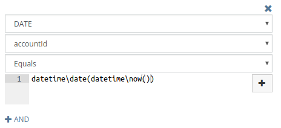
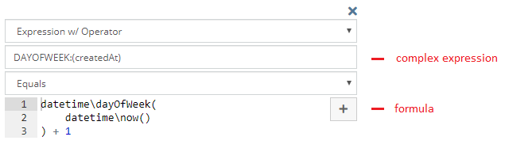
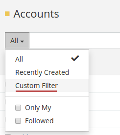

# Reports

The Reports feature is available in [Advanced Pack](https://www.espocrm.com/extensions/advanced-pack/). It provides the analytic capabilities and two additional functionalities: report panels and custom list view filters.

There are three types of reports:

* List
* Grid
* Joint Grid

In this article:

* [List reports](#list-reports)
* [Grid reports](#grid-reports)
* [Joint Grid reports](#joint-grid-reports)
* [Filters](#filters)
* [Displaying on dashboard](#displaying-on-dashboard)
* [Email sending](#email-sending)
* [Printing to PDF](#printing-to-pdf)
* [Syncing with Target Lists](#syncing-with-target-lists)
* [List view filters based on reports](#report-filters)
* [Reports panels](#report-panels)
* [Portal access](#portal-access)
* [Formula functions](#formula-functions)

See also:

* [Complex expressions](complex-expressions.md)
* [Quick tour](https://app.supademo.com/demo/cmca8j4uc1gy18qszrhdt68jy)


## List Reports

A List report displays the list of records that meet the specified criteria.

To create a new list report, click on the *Reports* tab and then click the *Create Report* button. Then, select the entity type to which your report will apply.

In the *Columns* field, select the fields you would like to have displayed in the report. Underneath, you can configure how each column is displayed with the following parameters:

* Width – width in percents;
* Align – how to align data: left or right;
* Link – value will be displayed as a link leading to the record detail view;
* Export Only – the column won't be displayed in report results on the UI, but it will be available in export;
* Not Sortable – the column cannot be ordered by, some fields are not available for sorting;
* Hidden – the column will be hidden but can be optionally shown in the report result view.

Choose the needed sorting in the *List Order* field.

In the *Filters* section, you can specify criteria that determine what records will be included in your report. You can use logical operators 'OR' and 'AND' here.

*Runtime Filters* lets you narrow down the results each time you run the report, without needing to edit the report itself. It's useful when the report structure stays the same, but you want to change the criteria dynamically – like choosing a specific date range, customer, or status before generating the results.

You can *export* list report results to XLSX (spreadsheet) and CSV formats.

An example of list report results:


Where list reports can be also utilized:

* Scheduled workflows – to do some scheduled actions over records that met criteria specified by a list report.
* Scheduled BPM processes – to start BPM processes for records that met some criteria.
* Sync with target lists – to add records that met some criteria to target lists, more info [below](#syncing-with-target-lists).
* List view filters – to filter records on the list view according to the criteria specified in the list report, more info [below](#report-filters).
* Panels on the detail view – to display related records that met some criteria on the side panel, more info [below](#report-panels).
* Applying assignment rule – to assign records that met specific criteria by workflow or BPM.

## Grid Reports

Grid reports display summarized values, can be grouped by one or two fields, and support chart visualization.

To create a new grid report, click on the *Reports* tab and then click the *Create Report* button. Then, select the entity type to which your report will apply.

When choosing the *Entity Type* for a grid report, consider the following. The *Entity Type* should contain the field that data will be aggregated by. For example, if you need to sum by the opportunity amount, choose the Opportunity entity type. If you need to aggregate by fields from different entity types, consider creating separate grid reports for each entity type and then use a Joint Report to join them into one.

An example of grid report results showing revenue grouped by a user:


!!! tip

    When dealing with long tables with many columns, you can use Shift + Mouse Wheel to scroll horizontally. It can also be helpful to use the Result View, which displays the report data in full width.

### Group By

In the *Group By* field, pick one or two fields you want your report data be grouped by. For date fields, it's possible to apply grouping by year, quarter, month, week, and day. If you leave the Group By field empty, the report will not apply any grouping.

There is the ability to craft a [complex expression](complex-expressions.md) for grouping. Complex expressions are internally translated into SQL statements. Complex expressions offer various use cases. For instance, the MAP function can be used to group data by region rather than by country.

Example:

```
MAP:(
    account.billingAddressCountry,
    'United States', 'United States',
    'Germany', 'Europe',
    'France', 'Europe',
    'Italy', 'Europe',
    'Other'
)
```

### Columns

In the *Columns* field, select one or more **aggregate** functions applied to a specific field.

Functions:

* COUNT – number of records;
* SUM – summation, applied to Currency, Int and Float fields;
* MIN – minimal value;
* MAX – maximal value;
* AVG – average value.

If a report is grouped by a link field, then it's possible to include fields from the linked record without an aggregate function applied to it. In the example below, the report for Opportunities with grouping by Campaign with Campaign.Budget column included.

It's possible to add **non-aggregated columns**. In this case, records will be displayed for each group. Note that if your report deals with a big number of records, it can run much slower.

Non-grouping grid report with non-aggregated columns:


Grouping grid report with non-aggregated columns:


There is the ability to craft [complex expressions](complex-expressions.md) for columns. Complex expressions are internally translated into SQL statements.

### Order by

The *Order By* field defines how the report results will be sorted.

### Filters section

In the *Filters* section, you can specify criteria to limit data displayed in the report results. You can use logical operators 'OR' and 'AND' here. See more info [below](#filters).

### Runtime filters

*Runtime Filters* lets you narrow down the results each time you run the report, without needing to edit the report itself.

!!! note

    Specifying a runtime filter can be also useful for dashlets and report panels. It allows to have filters applied to a particular dashlet or panel.

### Charts

Grid report allows displaying results in chart form.

There are the following chart types available:

* Bar (Horizontal);
* Bar (Vertical);
* Bar Grouped (Horizontal) (only for report with grouping by 2 columns);
* Bar Grouped (Vertical) (only for report with grouping by 2 columns);
* Pie (only for report with grouping by 1 column);
* Line.

Bar:


Bar Grouped:


Line:


Pie:


### Export

It's possible to export grid report results to XLSX (spreadsheet) and CSV formats. Both a results table and chart are exported to XLSX.

!!! important

    If a Grid report contains non-aggregated columns, te chart is not printed on the spreadsheet.

### Access

By checking *Apply access control*, the report result will not include records that the current user does not have access to.

If a regular user does not have edit access to the *Apply access control* field (via field level security in Roles), all reports they create will have the *Apply access control* automatically checked.

## Joint Grid reports

Joint Grid reports combine multiple Grid reports. A combined report can bring together data from reports that target different entity types.

Grid reports selected for a Joint report must use either one grouping field or none.

If you need to aggregate by fields from different entity types, consider creating separate Grid reports for each entity type and then use the Joint report type to combine them into one.

Some usage examples:

* Lead count / Contact count;
* Revenue by month / Campaign Budget by month;
* Revenue by user / Lead count by User.

You can create a new Joint Grid report from the dropdown menu in the top-right corner in the Reports list view.

Colors of chart columns are determined by chart colors set in the respective sub-reports.

Runtime filters are not supported in Joint reports. Only regular filters specified in each sub-report can be used.

Non-aggregate columns are not supported in Joint reports.

## Filters

### Field filter

Field filters are simple to use. They allow to filter by specific fields of a target entity type as well as fields of related records. For example, you can filter Opportunities by a field of the Account entity type.


### OR group

OR means that at least one condition in the group must be met.


### AND group

AND means that all conditions in the group must be met.

### NOT IN group

NOT IN provides the ability to filter records that don't meet specified criteria. E.g. listing accounts that don't have any opportunity with 'Closed Won' or 'Closed Lost' status.

!!! note

    It's recommended to avoid using NOT IN group when possible, by using filters 'Not Equals', 'None of', etc. instead. NOT IN group uses a sub-query that can negatively affect report performance in some cases.


### IN group

IN is similar to AND group but utilizes a sub-query.

The example of usage: Filtering accounts that have opportunities of both 'Closed Won' and 'Negotiation' stages.


### Complex Expression

For more advanced use. You can apply a database function to a certain database column and compare it with a result calculated by a [formula](../administration/formula.md) expression.

!!! note

    If you need to compare just with a simple string value you should put it into single quotes `'some string'`.

!!! note

    Formula functions intended to interact with the entity record will not work here because the formula is not applied to a specific record.

Applying function to a column and comparing with a result of formula:



Comparing the result of the custom complex expression and the result of the formula expression:



* Complex expression is translated into an SQL statement and becomes a part of an SQL query.
* Formula is executed before running the report and the result value is substituted into an SQL query.
* Comparison operator is substituted into an SQL query between the complex expression statement and the formula result value.

More info about complex expressions is available [here](complex-expressions.md).

!!! example

    Filter record that were created after less than 12 month from the creation of a related account. For example, it can be used to show sales only from new customers.

    ```
    LESS_THAN:(
        TIMESTAMPDIFF_MONTH:(
            account.createdAt,
            createdAt
        ),
        12
    )
    ```

### Having group

The Having group provides the ability to filter records with using aggregate functions COUNT, SUM, MAX, MIN, AVG.

Some use cases:

* List of accounts having more than one opportunity. `COUNT / opportunities.id / Greater Than / 1`.
* Grid report showing accounts grouped by industry where revenue is more than 1,000. `SUM / opportunities.amount / Greater Than / 1000`.

## Displaying on dashboard

You can display any report on the dashboard. In order to do it, you need to add the Report dashlet to the dashboard and then pick the needed report from the dashlet options.

For grid reports it's possible to display:

* Chart
* Chart & Total
* Total
* Table

For list reports it's possible to display:

* List
* Total (number or records)

For list reports, you can either display the list or records or only the total number of records.

Dashlet with only totals displayed:


## Email sending

It's possible to set up the system send report results to certain users on a regular basis according to specified time. This must be configured for certain reports individually.

The Max number of records that can be sent in an email by default is set to 3000. You can increase it by adding the parameter to data/config.php: `'reportSendingListMaxCount' => 5000`.

## Printing to PDF

!!! note

    A user needs to have access to the *Template* scope in Roles.

    You need to have at least one PDF Template record for the Report entity type. The template can be created at Administration > PDF Templates.

To print a Report: on the Report detail view on the *Report* panel, from the dropdown next to the *Edit* button, click *Print to PDF*.

In a PDF template, `{{reportTable}}` helper is used to print a report results table.

Example:

```
{{reportTable border=1 borderColor="#333" cellpadding=2 fontSize=9}}
```

Available attributes:

* border – a border with;
* borderColor;
* cellpadding;
* fontSize;
* color – a text color;
* flip – to flip table, true or false;
* width – a table width, a CSS parameter (as of v3.1).

## Syncing with Target Lists

It's possible to have target lists synced with list report results. It's convenient for mass email when you would like to send emails only to contacts that meet some criteria at the moment of sending. This feature is available in the detail view of any target list in the *Sync with Reports* panel.

## Report filters

The Report Filters feature allows you to create custom primary filters for list views. These filters can also be used in specific formula functions.

An administrator can create custom list view filters based on specific reports. Available under: Administration > Report Filters. It's possible to specify teams that will have access to the filter.

!!! note

    The layout, that is specified in the report, is not applied to the list view when the filter is selected.



Report filters can utilized in *Record List* dashlets (as a primary filter).

Report filters can be utilized in [formula functions](../administration/formula.md#filter):

* `record\count`
* `record\findOne`
* `record\findRelatedOne`
* `record\findRelatedMany`
* `entity\sumRelated`
* `entity\countRelated`

## Report panels

The Report Panels feature allows you to create custom detail view panels that display report results.

An administrator can create custom side and bottom panels for the detail view of the specific entity type. It's possible to specify teams that will have access to the panel.

Both Grid and List reports can be used.

For grid reports it's possible to display:

* Chart
* Chart & Total
* Total
* Table (as of v2.7.0)

For list reports it's possible to display:

* List
* Total (number or records)

The order of side panels can be customized under: Administration > Entity Manager > {Entity Type} > Layouts > Side Panels (Detail).

The order of bottom panels can be customized under: Administration > Entity Manager > {Entity Type} > Layouts > Bottom Panels.

The report panel displays results related to the record that is viewed. The first found relationship is used. If a report has an appropriate runtime filter, then it will be used to filter report results. The runtime filter must be a field of a Link, Link-multiple or Link-parent type. "For example, if a report is for Opportunity and has a runtime filter Account, that filter will be automatically applied when the report panel is added to the Account detail view.

## Portal access

Specific reports can be allowed for specific portals. For this, you need to add the portal in the *Portals* field of the Report. The Portal Role assigned to the portal should have defined access to the *Reports* scope with the *Read* action set to *all*.

It's possible to add a report dashlet to the portal dashboard.

!!! note

    For grid reports which are meant be available in the portal, it's usually reasonable to enable [Apply ACL](#access).

## Formula functions

### report\export

`report\export(REPORT_ID, [USER_ID])`

*As of v3.6.*

Generates an XLSX export file and returns an attachment ID. An optional USER_ID allows to apply access restrictions for a specific user. Note that generated attachments have the role `Export File`, hence they will be automatically deleted by the cleanup job. To prevent deletion, you can change the role to `Attachment`.

## See also

* [Complex expressions](complex-expressions.md)
* [Billing transactions](https://www.espocrm.com/blog/tutorial-billing-transactions/)
