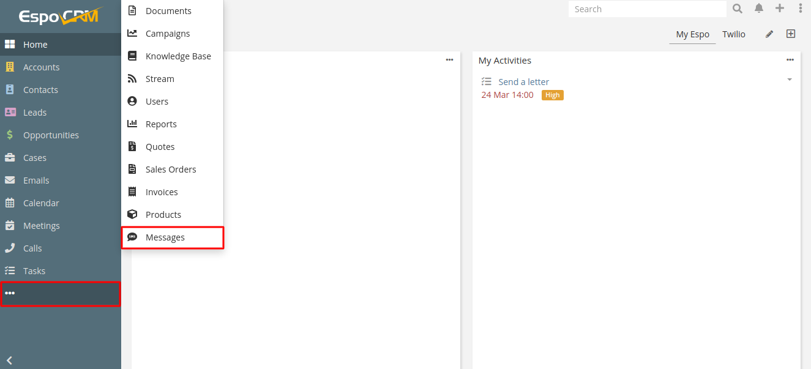

# Add access control in EspoCRM

By default regular users don’t have access to Message entity. Administrator needs to grant access to this entity:

1. Login as Administrator in EspoCRM.
2. Navigate to the Administration > Roles.
3. Create / edit a Twilio role.
4. Grant access to the Message entity.

By default the Message entity tab should be addad into the tab list.

