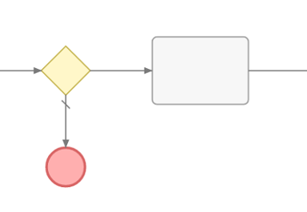
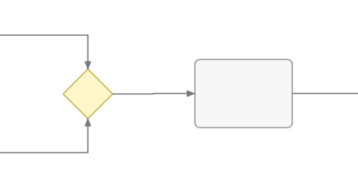
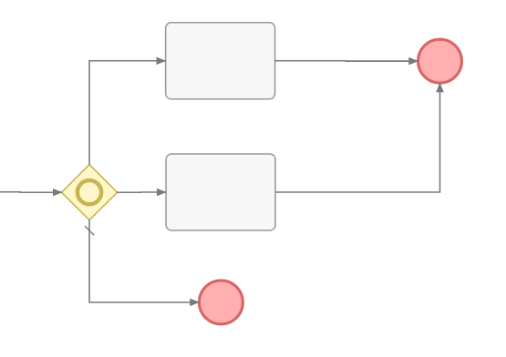
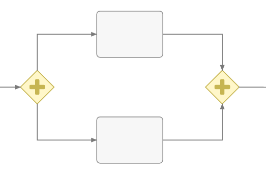
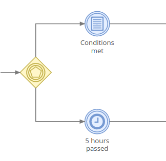
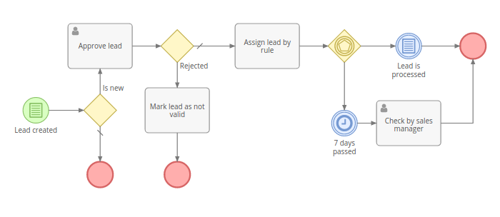
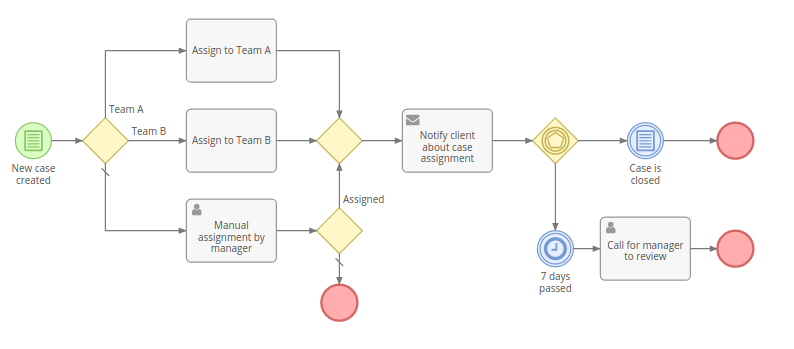
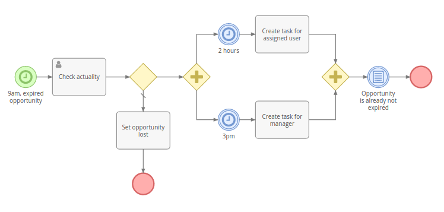

# Business Process Management

La herramienta Business Process Management (BPM) brinda la capacidad de modelar y automatizar procesos comerciales en EspoCRM. Es un motor que ejecuta procesos comerciales descritos en el estándar BPMN 2.0. La herramienta BPM está disponible en la extensión 

### Diferencia de la herramienta de flujos de trabajo

La herramienta Flujos de trabajo está diseñada para la automatización de reglas comerciales simples, sin elementos de flujo secuencial, cuando no es necesario mostrar el flujo de forma gráfica.

La herramienta BPM está diseñada para flujos de negocios más complejos, donde puede haber flujos divergentes y convergentes, retrasos en la ejecución e interacciones del usuario. Una vista del diagrama de flujo hace que el proceso comercial sea más comprensible para un ser humano, un registro permite ver cómo se llevó a cabo el proceso.

## Diagramas de flujo de proceso

El enlace para procesar diagramas de flujo está disponible desde el panel de administración. También se puede agregar como una pestaña en el panel de navegación.

Los diagramas de flujo están destinados al modelado de procesos de negocio. El administrador puede crear y editar diagramas de flujo. Los usuarios normales solo pueden ver diagramas de flujo.

Cada diagrama de flujo tiene su tipo de entidad específica (campo Tipo de objetivo). El diagrama de flujo determina la ejecución de instancias de proceso futuras. Comprende elementos de diagrama de flujo y conexiones entre elementos.

Si el diagrama de flujo del proceso tiene desactivado el campo "Está activo", no iniciará las instancias del proceso.

Para mostrar detalles y parámetros de un cierto elemento del diagrama de flujo, debe hacer clic en él. En el modo de edición, podrá editar los parámetros.

## Procesos

Los procesos están disponibles desde el panel de administración. El enlace también se puede agregar como una pestaña en el panel de navegación.

El proceso representa la instancia del proceso empresarial. Cuando se inicia, obtiene el estado 'Iniciado'. Cuando el proceso finaliza, obtiene el estado 'Terminado'. El proceso también puede ser detenido manualmente por un usuario que tiene acceso para editar el proceso. Si se detiene manualmente, obtiene el estado 'Detenido'.

El proceso se ejecuta de acuerdo con el diagrama de flujo. El diagrama de flujo del proceso no se puede cambiar después de iniciar el proceso.

El proceso está relacionado obligatoriamente con un solo registro objetivo.

Los procesos se pueden iniciar automáticamente (en condiciones específicas o por programación) o manualmente (cuando hay al menos un evento de inicio en el diagrama de flujo). Para iniciar el proceso manualmente, el usuario debe hacer clic en el botón "Iniciar proceso" en la vista de lista de procesos.

## Elementos del diagrama de flujo

### Eventos

Los eventos se muestran en un diagrama de flujo como círculos.

#### Evento de inicio

No tiene parámetros Es un punto de partida del proceso. El evento de inicio puede iniciarse manualmente por un usuario que tenga acceso para crear procesos. El usuario debe hacer clic en el botón 'Iniciar proceso' en la vista de lista de procesos.

#### Evento de inicio condicional

Un punto de partida del proceso. Se supone que debe activarse automáticamente cuando se cumplen las condiciones especificadas. Hay dos tipos de activador: 'Después de crear el registro', 'Después de guardar el registro'.

#### Evento de inicio del temporizador

Un punto de partida del proceso. Inicia procesos por programación. Debe especificar el informe de lista que devuelve registros para iniciar procesos y programar en notación crontab.

#### Evento intermedio condicional

Este evento detiene el flujo hasta que se cumplan los criterios especificados.

#### Evento intermedio del temporizador

Este evento detiene el flujo y espera mientras esté especificado por los parámetros del evento.

Para configuraciones de temporizador más complejas, puede utilizar [fórmula](formula.md). Los scripts de fórmulas deben devolver el valor de Fecha y hora (en la zona horaria UTC). Una vez que llegue este momento, el flujo pasará al siguiente elemento.

Al utilizar la función de fórmulas datetime \ más cercana, es posible establecer el temporizador en un momento específico en el futuro, p. el comienzo del siguiente día hábil.

#### Fin del evento

Termina el flujo actual. No finaliza los flujos que se ejecutan en paralelo. Cuando el flujo llega al evento final y no hay nada en ejecución en paralelo, el proceso finaliza.

#### Terminar evento final

Finaliza todos los flujos. El proceso se terminó posteriormente.

### Puertas de enlace

Las puertas de enlace se muestran como diamantes.

#### Puerta de enlace exclusiva

Puede divergir o converger flujos.

En caso de divergencia, define un único flujo (camino) que se elegirá según los criterios especificados. La primera condición cumplida determina el flujo, las siguientes condiciones se omiten. Existe la posibilidad de especificar el flujo predeterminado. El flujo predeterminado se elige si no hay ninguna condición cumplida. El flujo predeterminado está marcado con un signo de barra inclinada.

En caso de convergencia, solo dirige el flujo hacia el elemento saliente. No se bloquea después del flujo, por lo que los flujos paralelos no se fusionarán en un solo flujo.

#### Puertas de enlace inclusivos

Puede divergir o converger flujos.

En caso de divergencia, puede dirigir a uno o múltiples flujos paralelos (rutas), dependiendo del cumplimiento de los criterios de cada flujo. El flujo predeterminado se elige si no hay ninguna condición cumplida. El flujo predeterminado está marcado con un signo de barra inclinada.

Si es necesario fusionar los flujos paralelos producidos por una puerta de enlace inclusiva divergente, debe utilizar una puerta de enlace inclusiva convergente. Esperará todos los flujos entrantes y luego continuará hacia el elemento saliente.

Nota: Las pasarelas divergentes y convergentes deben estar equilibradas.

Nota: Si uno de los flujos paralelos se ha terminado por algún motivo, la puerta de enlace divergente nunca se procesará. El proceso será bloqueado. Evite un diseño de diagrama de flujo que pueda provocar tal situación.

#### Puertas de Enlace Paralelas

Puede divergir o converger flujos.

En caso de divergencia, el flujo se divide en múltiples flujos paralelos. No hay parámetros para este tipo de puerta de enlace.

En caso de convergencia, espera hasta que lleguen todos los flujos entrantes y luego continúa hasta el siguiente elemento saliente.

Nota: Las pasarelas divergentes y convergentes deben estar equilibradas.

Nota: Si uno de los flujos paralelos se ha terminado por algún motivo, la puerta de enlace divergente nunca se procesará. El proceso será bloqueado. Evite un diseño de diagrama de flujo que pueda provocar tal situación.

#### Puertas de Enlace basadas en eventos

Solo puede divergir flujos.

Detiene el flujo hasta que cualquiera de los eventos salientes se active. El evento desencadenado determina el flujo único. Otros eventos salientes son rechazados.

Solo los eventos intermedios pueden estar en el otro extremo de los flujos de secuencia de salida.

### Actividades

Las actividades se muestran como rectángulos redondeados.

#### Tareas

La tarea se puede ejecutar siguiendo las acciones:

* Crear registro: crea un nuevo registro de cualquier tipo de entidad;
* Crear registro relacionado: crea un nuevo registro relacionado con el registro objetivo;
* Actualizar registro objetivo;
* Actualizar registro relacionado: actualiza el registro o los registros relacionados con el registro objetivo;
* Actualizar registro creado: actualiza el campo específico de cualquier registro creado en el proceso actual;
* Registro de proceso de actualización: se puede usar para asignar el proceso a un usuario o equipo específico;
* Enlace a otro registro: vincula el registro objetivo con un registro especificado;
* Desvincular de otro registro: desvincula el registro objetivo del registro especificado;
* Aplicar regla de asignación: asigna el registro objetivo, el registro del proceso o cualquier registro creado por el proceso de acuerdo con la regla específica;
* Crear notificación: crea notificaciones en la aplicación para usuarios específicos;
* Hacer seguimiento: hace que los usuarios específicos sigan el registro objetivo, el registro del proceso o cualquier registro creado por el proceso;
* Ejecutar acción de servicio: ejecuta acciones de servicio personalizadas implementadas por los desarrolladores.

Las acciones disponibles para la tarea son casi las mismas que en la función de flujo de trabajo. Ver más detalles sobre [acciones del flujo de trabajo](workflows.md#actions).

#### Enviar mensaje de Tarea

Envía un mensaje de correo electrónico a un destinatario específico.

#### Tarea de usuario

Proporciona una capacidad flexible de interacción del usuario. Detiene la ejecución hasta que el usuario (especificado explícitamente o por regla de asignación) resuelve la tarea. El registro de Tarea de usuario de proceso se creará en el sistema. Por defecto hay tres tipos de acciones: Aprobar, Revisar, Lograr.

* El tipo de aprobación requiere que el usuario elija entre 'Aprobado' y 'Rechazado'.
* El tipo de revisión brinda solo una opción: 'Revisado'.
* El tipo de realización tiene dos opciones: 'Completado' y 'Fallido'.

El usuario asignado al registro de Tarea de usuario de proceso creado recibirá una notificación en la aplicación. El administrador también puede habilitar las notificaciones por correo electrónico.

Los usuarios también pueden agregar el dashlet Tareas de usuario de proceso en su tablero para ver sus tareas de usuario de proceso reales.

Es posible leer la resolución de la tarea del usuario pasado dentro de puertas de enlace divergentes o eventos condicionales, haciendo una ramificación en el flujo del proceso.

#### Tarea de script

Ejecuta el script en lenguaje [espo-formula](formula.md). Todas las variables establecidas (`$variableName`) se almacenarán y estarán disponibles dentro del proceso.

### Flujos

#### Flujo de secuencia

Representado como una flecha sólida. Indica el orden en que se ejecutarán los elementos del proceso.

## Condiciones

Los eventos condicionales, las puertas de enlace divergentes exclusivas e inclusivas tienen condiciones que determinan el flujo del proceso.

A través de la interfaz de usuario existe la posibilidad de verificar las condiciones para los siguientes registros:

* Registro objetivo;
* Registros relacionados con el objetivo a través de relaciones de muchos a uno e hijos a padres;
* Registros creados por el proceso a través de tareas;
* Registros de tareas del usuario, lo que permite verificar la resolución.

También es posible definir condiciones en el lenguaje [Espo-formula](formula.md).

Las condiciones en la herramienta BPM son las mismas que en la función de flujo de trabajo. Ver más detalles sobre [las condiciones del flujo de trabajo](workflows.md#conditions).

## Ejemplos

### Ejemplo 1

### Ejemplo 2

### Ejemplo 3

