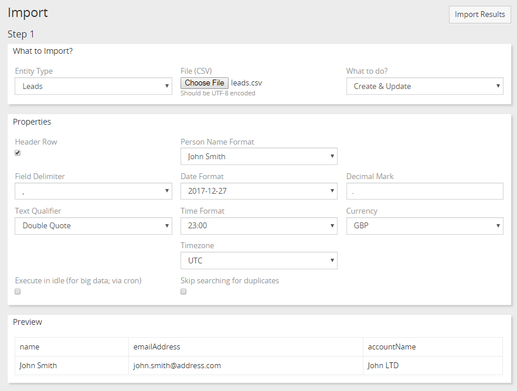
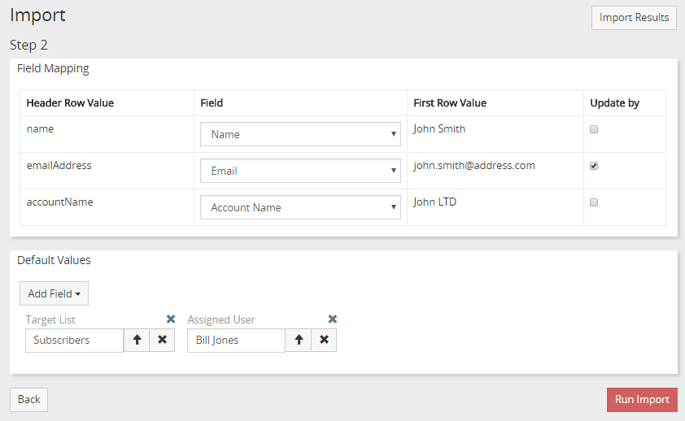

# Importar

Importar solo es accesible para usuarios administrativos. Administration> Import Puede importar solo desde archivos CSV.

## Paso 1

Seleccione qué tipo de registros necesita importar (campo Tipo de entidad).
Seleccione un archivo CSV. Un archivo debe formatearse con `UTF-8`.
Seleccione `¿Qué hacer?`. Opciones disponibles: 'Crear solo', 'Crear y actualizar', 'Solo actualizar'.

* `Create Only` - selecciónelo si quiere que el registro se cree solo.
* `Crear y actualizar`: se crearán registros, pero si se encuentran registros con valores de campo coincidentes, se actualizarán. Podrás comprobar con qué campos coincidir en el _Step 2_.
* `Solo actualización`: solo se encontrarán registros con valores de campo coincidentes, se actualizarán.
Once you select a csv file you will be able to see how it should be parsed in Preview panel. When you change properties the preview will be updated. 

* `Header Row` - si el archivo CSV tiene la primera fila con los nombres de los campos.
* `Execute in ocioso`: recomendado si tiene un gran grupo de registros para importar. La importación se procesará a través de cron. El estado se establecerá en 'Completado' cuando finalice el proceso de importación.
* `Omitir búsqueda de duplicados` - disminuirá el tiempo de ejecución de importación.

Haga clic en el botón _Next_ para pasar al _Paso 2_ ..

## Paso 2

Configure la asignación de campo: cómo los campos corresponden a las columnas del archivo csv. Puede omitir las columnas que no sean necesarias aquí.
En los casos de 'Crear y actualizar' y 'Actualizar solamente', debe verificar los campos por los cuales se encontrarán los registros que se deben actualizar.
Agregue los valores predeterminados con los que desea que se establezcan los registros nuevos y actualizados. P.ej. puede especificar campos de Usuario asignado o Equipos.

Una vez realizada la importación, podrá revertir los registros creados, ver duplicados y registros actualizados. Duplicar significa que hubo un registro similar en el sistema. Puede eliminar todos los duplicados importados a la vez. Nota: Revertir no funciona con registros actualizados.

Click en el boton _Run Import_ para continuar. Puede tomar algún tiempo antes de que finalice un proceso de importación. Si desea importar un gran grupo de registros (depende de la configuración de su servidor, generalmente si hay más de 200 registros), debe asegurarse de que el parámetro php `set_time_limit` sea lo suficientemente grande.

## Cómo importar a la lista de objetivos

Cuando importa Contactos, Clientes potenciales o Cuentas, puede agregarlos a una lista de objetivos. En el Paso 2, debe agregar el campo Lista de objetivos en el panel `Valores predeterminados` y seleccionar un registro de lista de objetivos necesario. También puede usar la importación `Actualizar solo` o` Crear y actualizar` para agregar objetivos existentes a una lista de objetivos.
