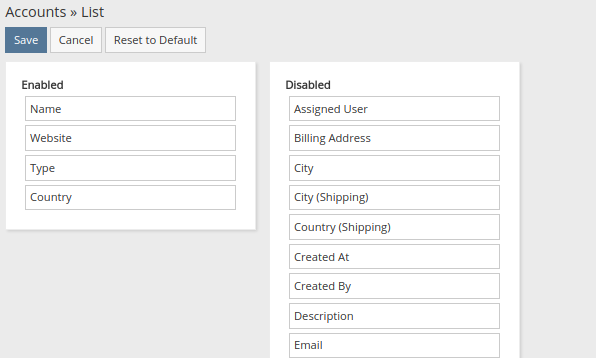
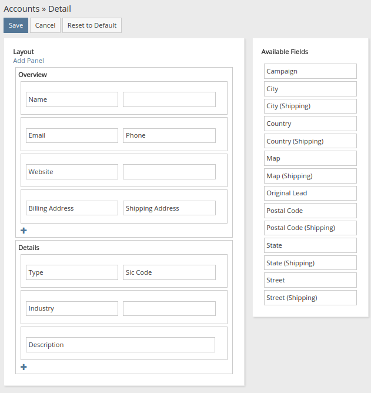

# Layout Manager

Layout Manager está disponible en el panel de administración. Ofrece la posibilidad de personalizar la apariencia de detalles, editar, mostrar vistas, así como también buscar filtros y campos para formularios de actualización masiva.

## Listas

El diseño principal de la vista de lista. Define columnas y sus parámetros.

Los parámetros disponibles para las columnas se enumeran a continuación.

### Ancho (%)

Ancho de columna en porcentaje, vacío significa ancho automático.

### Link

Si se selecciona, el campo se mostrará como un enlace a la vista de detalle del registro. Usualmente se usa para campos de nombre.

### No ordenable

Desactiva la capacidad de ordenar la columna.

### Align

Align the column to the left or to the right.

## Detalles

El diseño principal de la vista de detalles y la vista de edición. Define paneles, filas y celdas. Las celdas contienen campos.

La fila puede contener dos celdas o una celda que se expande al ancho completo de la fila. Para agregar la fila con una celda expandida, debe agregar la nueva fila y hacer clic en un signo menos en cualquier celda.

## Lista (pequeña)

El diseño de la lista para paneles de relaciones. También se puede usar en otros lugares donde es razonable mostrar listas en la vista estrecha.

## Detalle (Pequeño)

La vista de detalle para crear rápidamente, vista rápida y formularios de edición rápida.

## Filtros de búsqueda

La lista de campos disponibles en la vista de lista para buscar por.

## Actualización masiva

La lista de campos disponibles en el formulario de Actualización masiva.

## Paneles de relación

La lista de paneles de relaciones que se muestran en la vista de detalles en la parte inferior. Los paneles pueden ser reordenados. Es posible definir el color del panel con el parámetro Estilo.

## Paneles laterales

Paneles laterales para Detalle, Editar, Detalle Pequeño, Editar formularios pequeños. Proporciona la capacidad de ocultar o reordenar los paneles de actividades, historial, tareas y otros. Los paneles pueden ser coloreados por el parámetro Estilo.

## Diseños adicionales

Algunos tipos de entidades contienen diseños adicionales: Convertir plomo, Lista para cuenta.
