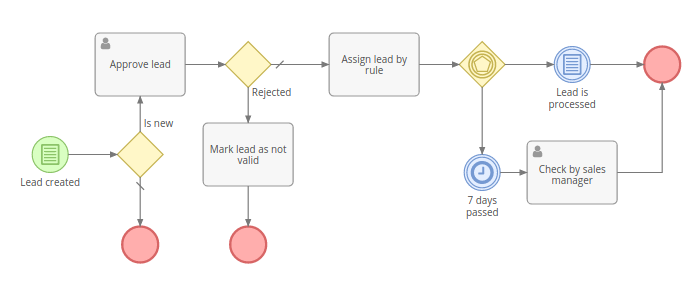

# Gestione dei processi aziendali

Lo strumento Business Process Management (BPM) offre la possibilità di modellare e automatizzare i processi aziendali in EspoCRM. È un motore che esegue i processi aziendali descritti nello standard BPMN 2.0. Lo strumento BPM è disponibile nell'estensione [Advanced Pack] (https://www.espocrm.com/extensions/advanced-pack/).

### Differenza dallo strumento Flussi di lavoro

Lo strumento Flussi di lavoro è destinato all'automazione di semplici regole aziendali, senza elementi di flusso sequenziale, quando non è necessario visualizzare graficamente il flusso.

Lo strumento BPM è destinato a flussi aziendali più complessi, in cui possono essere presenti flussi divergenti e convergenti, ritardi nell'esecuzione, interazioni dell'utente. Una vista del diagramma di flusso rende il processo aziendale più comprensibile per un essere umano, un registro consente di vedere come è stato tenuto il processo.

## Elabora diagrammi di flusso

Il link per elaborare i diagrammi di flusso è disponibile dal pannello di amministrazione. Può anche essere aggiunto come una scheda sul pannello di navigazione.

I diagrammi di flusso sono destinati alla modellazione dei processi aziendali. L'amministratore può creare e modificare diagrammi di flusso. Gli utenti normali possono solo visualizzare i diagrammi di flusso.

Ogni diagramma di flusso ha il suo tipo di entità specifico (campo Tipo di destinazione). Il diagramma di flusso determina l'esecuzione delle istanze di processo future. Comprende elementi del diagramma di flusso e connessioni tra gli elementi.

Se il diagramma di flusso del processo ha il campo "È attivo" deselezionato, allora non avvierà le istanze di processo.

Per mostrare dettagli e parametri di un determinato elemento del diagramma di flusso è necessario fare clic su di esso. In modalità modifica sarai in grado di modificare i parametri.

## Processi

I processi sono disponibili dal pannello di amministrazione. Il collegamento può anche essere aggiunto come una scheda sul pannello di navigazione.

Il processo rappresenta un'istanza del processo di business. Quando viene avviato, ottiene lo stato 'Iniziato'. Quando il processo è finito, ottiene lo stato 'Fine'. Il processo può anche essere fermato manualmente da un utente che ha un accesso per modificare il processo. Se viene arrestato manualmente, ottiene lo stato "Arrestato".

Il processo viene eseguito secondo il diagramma di flusso. Il diagramma di flusso del processo non può essere modificato dopo l'avvio del processo.

Il processo è obbligatorio in relazione al singolo record di destinazione.

I processi possono essere avviati automaticamente (in base a condizioni specifiche o in base alla pianificazione) o manualmente (dove è presente almeno un evento di avvio nel diagramma di flusso). Per avviare manualmente il processo, l'utente deve fare clic sul pulsante "Avvia processo" nella visualizzazione elenco dei processi.

## Elementi del diagramma di flusso

### eventi

Gli eventi vengono visualizzati su un diagramma di flusso come cerchi.

#### Avvia evento

Non ha parametri. È un punto di partenza del processo. L'evento di inizio può essere avviato manualmente da un utente che ha accesso alla creazione di processi. L'utente deve fare clic sul pulsante "Avvia processo" nella visualizzazione elenco dei processi.

#### Evento di inizio condizionato

Un punto di partenza del processo. Dovrebbe essere attivato automaticamente quando vengono soddisfatte le condizioni specificate. Esistono due tipi di trigger: "Dopo record creato", "Dopo record salvato".

#### Evento di avvio del timer

Un punto di partenza del processo. Avvia i processi tramite la pianificazione. È necessario specificare il report elenco che restituisce i record per l'avvio dei processi e la pianificazione nella notazione crontab.

#### Evento intermedio condizionale

Questo evento arresta il flusso finché non vengono soddisfatti i criteri specificati.

#### Evento intermedio del timer

Questo evento arresta il flusso e attende fino a quando viene specificato dai parametri dell'evento.

Per impostazioni del timer più complesse puoi utilizzare [formula] (formula.md). Gli script di formula devono restituire il valore Date-Time (nel fuso orario UTC). Una volta giunto il momento, il flusso verrà trasferito all'elemento successivo.

Utilizzando la funzione di formula data / ora più vicina è possibile impostare il timer in un momento specifico in futuro, ad es. l'inizio della prossima giornata lavorativa.

#### Fine evento

Termina il flusso corrente. Non finisce i flussi che corrono in parallelo. Quando il flusso raggiunge l'evento finale e non c'è nulla che funzioni in parallelo, il processo termina.

#### TTermina evento finale

Termina tutti i flussi. Il processo è successivamente terminato.

### Gateway

I gateway sono visualizzati come diamanti.

#### Gateway esclusivo

Può divergere o convergere i flussi.

In caso di divergenza definisce un singolo flusso (percorso) che verrà scelto in base a criteri specifici. La prima condizione soddisfatta determina il flusso, le prossime condizioni sono omesse. C'è la possibilità di specificare il flusso predefinito. Il flusso predefinito viene scelto se non ci sono condizioni soddisfatte. Il flusso predefinito è contrassegnato da un segno di barra.

In caso di convergenza dirige semplicemente il flusso verso l'elemento in uscita. Tuttavia, non viene bloccato dopo il flusso, quindi i flussi paralleli non verranno uniti nel flusso singolo.

#### Gateway inclusivo

Può divergere o convergere i flussi.

In caso di divergenza, può dirigere verso uno o più flussi paralleli (percorsi), in base al raggiungimento dei criteri di ciascun flusso. Il flusso predefinito viene scelto se non ci sono condizioni soddisfatte. Il flusso predefinito è contrassegnato da un segno di barra.

Se è necessario unire flussi paralleli prodotti da un gateway inclusivo divergente, è necessario utilizzare un gateway inclusivo convergente. Attenderà tutti i flussi in entrata e quindi continuerà con l'elemento in uscita.

Nota: i gateway divergenti e convergenti devono essere bilanciati.

Nota: se uno dei flussi paralleli è stato terminato per qualche motivo, il gateway divergente non verrà mai elaborato. Il processo sarà bloccato. Evitare un design del diagramma di flusso che possa provocare una situazione del genere.

#### Gateway parallelo

Può divergere o convergere i flussi.

In caso di divergenza, divide il flusso in più flussi paralleli. Non ci sono parametri per questo tipo di gateway.

In caso di convergenza, attende fino a quando tutti i flussi in arrivo arrivano e poi continua al prossimo elemento in uscita.

Nota: i gateway divergenti e convergenti devono essere bilanciati.

Nota: se uno dei flussi paralleli è stato terminato per qualche motivo, il gateway divergente non verrà mai elaborato. Il processo sarà bloccato. Evitare un design del diagramma di flusso che possa provocare una situazione del genere.

#### Gateway basato su eventi

Possono solo divergere i flussi.

Arresta il flusso fino a quando non viene attivato nessuno degli eventi in uscita. L'evento innescato determina il singolo flusso. Altri eventi in uscita vengono rifiutati.

Solo gli eventi intermedi possono essere dall'altra parte dei flussi di sequenza in uscita.

### attività

Le attività sono visualizzate come rettangoli arrotondati.

#### Compito

L'attività può essere eseguita seguendo le azioni:

* Crea record: crea un nuovo record di qualsiasi tipo di entità;
* Crea record correlato: crea un nuovo record correlato al record di destinazione;
* Aggiorna record di destinazione;
* Record correlato all'aggiornamento: aggiorna il record o i record relativi al record di destinazione;
* Aggiorna record creato - aggiorna il campo specifico di qualsiasi record creato nel processo corrente;
* Record processo di aggiornamento - può essere utilizzato per assegnare il processo a specifici utenti o team;
* Link ad un altro record: collega il record di destinazione con un record specificato;
* Scollega da un altro record: scollega il record di destinazione dal record specificato;
* Applica regola di assegnazione: assegna il record di destinazione, il record di processo o qualsiasi record creato dal processo in base alla regola specifica;
* Crea notifica: crea notifiche in-app per utenti specifici;
* Make Followed: consente a utenti specifici di seguire il record di destinazione, il record del processo o qualsiasi record creato dal processo;
* Esegui azione di servizio: esegue azioni di servizio personalizzate implementate dagli sviluppatori.

Le azioni disponibili per l'attività sono quasi le stesse della funzione Flusso di lavoro. Vedi maggiori dettagli su [workflow's actions](workflows.md#actions).

#### Invia attività messaggio

Invia un messaggio e-mail a un destinatario specifico.

#### Task utente

Fornisce una capacità flessibile di interazione dell'utente. Interrompe l'esecuzione fino a quando l'utente (specificato esplicitamente o in base alla regola di assegnazione) risolve l'attività. Il record del processo utente processo verrà creato nel sistema. Di default ci sono tre tipi di azione: Approva, Rivedi, Realizza.

* Approva il tipo richiede all'utente di scegliere tra 'Approvato' e 'Rifiutato'.
* Il tipo di revisione offre solo un'opzione: "Revisionata".
* Compilare il tipo ha due opzioni: "Completato" e "Fallito".

L'utente assegnato al record Process Process User creato riceverà una notifica in-app. L'amministratore può anche abilitare le notifiche e-mail.

Gli utenti possono anche aggiungere un dashlet Task Process Task sul loro dashboard per vedere le loro effettive attività dell'utente del processo.

È possibile leggere la risoluzione del compito utente passato all'interno di gateway divergenti o eventi condizionali, rendendo la ramificazione nel flusso del processo.

#### Script Task

Executes the script in [espo-formula](formula.md) language. All set variables (`$variableName`) will be stored and available within the process.

### flussi

#### Flusso di sequenza

Rappresentato come una freccia solida. Indica l'ordine in cui verranno eseguiti gli elementi del processo.

## condizioni

Eventi condizionali, gateway divergenti esclusivi e inclusivi hanno condizioni che determinano il flusso del processo.

Tramite l'interfaccia utente è possibile verificare le condizioni per i seguenti record:

* Record di destinazione;
* Record relativi all'obiettivo attraverso relazioni multi-to-uno e da bambini a genitore;
* Record creati dal processo tramite attività;
* Record dei compiti dell'utente, che consente di verificare la risoluzione.

È anche possibile definire le condizioni in [Espo-formula](formula.md) linguaggio.

Le condizioni nello strumento BPM sono le stesse della funzione Flusso di lavoro. Vedi maggiori dettagli su [condizioni del flusso di lavoro] (condizioni workflow.md #).
## Examples

### Example 1

### Example 2

### Example 3

