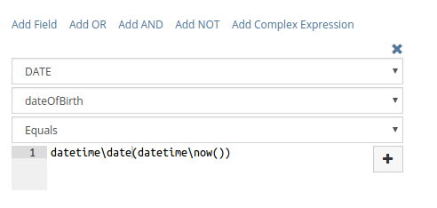

# Reports

Reports feature is available in [Advanced Pack](https://www.espocrm.com/extensions/advanced-pack/).

There are two types of reports: List and Grid.  

## List Reports

List report results the list of records that meet the specified criteria.

To create new list report click on Reports tab and then click Create Report button. Choose needed Entity Type then click Create button at List Report section.

At _Columns_ field pick fields you would like to be displayed. Below you can specify display parameters for every column e.g. width and align.

Choose needed sorting at _List Order_ field. 

At _Filters_ section you can specify criteria that determines what records will be listed in your report. You can use logical operators 'OR' and 'AND' here.

_Runtime Filters_ allow you to specify different filters before you run the report.

You can __export__ list report results to excel and csv formats.

## Grid Reports

Grid reports result summarized values grouped by specified fields. These reports can be displayed as a chart.

To create new grid report click on Reports tab and then click Create Report button. Choose needed Entity Type then click Create button at Grid Report section.

At _Group By_ field pick one or two fields you want your report data be grouped by. It's possible to group by year, month, day for date fields. If you group by two fields your report will be considered as three-dimensional.

At _Columns_ field select one or more aggregate functions like COUNT, SUM (summation), MIN, MAX, AVG (average).

_Order by_ field defines how report data will be sorted.

At _Filters_ section you can specify criteria that determines what records will be used in your report. You can use logical operators 'OR' and 'AND' here.

_Runtime Filters_ allows you to specify different filters before you run the report.

Grid report allows displaying results in a chart form. There are following _chart types_: Bar (Horizontal), Bar (Vertical), Pie, Line.

It's possible to __export__ grid report results to excel and csv formats.

## Filters

### Field filter

Simple to use type of filters. You can also pick fields of target entity as well as related entitites.

### OR group

OR means that at least one condition under the group must be met.

### AND group

AND means that all conditions under the group must be met.

### NOT group

Provides an ability to filter records that don't meet specified criteria. E.g. listing accounts that don't have any opportunity with Closed Won or Closed Lost status.

### Complex Expression

For more advanced use. You can apply function for certain database column and compare it with the result of [formula](../administration/formula.md) expression.

Note: If you need to compare just with a simple string value you should put it into single quotes `'some string'`.

Note: Functions intended to interact with entity record will not work here because formule is not applied to specific record.

## Displaying on dashboard

You can display any report on dashboard. For this you need add Report dashlet and then pick needed report at dashlet options.

## Email Sending

It's possible to make system to send report results to certain users on regular basis according specified time. This must be configured for certain reports individually.

## Syncing with Target Lists

It's possible to have target lists synced with list report results. It's convenient for mass email when you would like to send emails only to contacts that meet some criteria at the moment of sending. This feature is available on detail view of any target list at 'Sync with Reports' panel.
